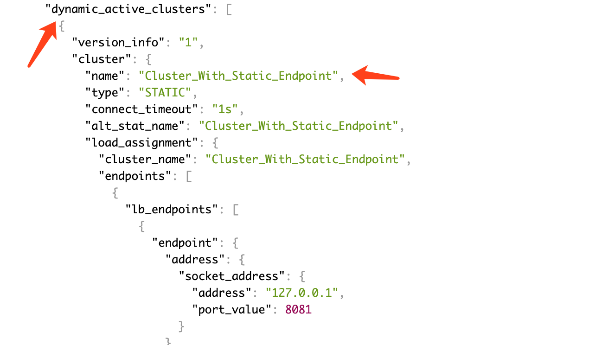

<!-- toc -->
# envoy 用 XDS 动态发现配置的方法

这里使用的配置文件是 [envoy-docker-run/envoy-1-xds.yaml][1]。

## 配置 XDS 的地址

首先在配置文件中静态配置控制平面的地址，地址为简陋控制平面的服务地址，注意将地址修改你自己的环境中的地址：

```yaml
static_resources:
  clusters:
  - name: xds_cluster
    connect_timeout: 0.25s
    type: STATIC
    lb_policy: ROUND_ROBIN
    http2_protocol_options: {}
    load_assignment:
      cluster_name: xds_cluster
      endpoints:
      - lb_endpoints:
        - endpoint:
            address:
              socket_address:
                #address: 127.0.0.1
                address: 192.168.99.1
                port_value: 5678
```

## 配置 cds_config 和 lds_config

然后在 cds_config 和 lds_config 中引用前面的配置的 xds_cluster：

```yaml
dynamic_resources:
  cds_config:
    api_config_source:
      api_type: GRPC
      grpc_services:
        envoy_grpc:
          cluster_name: xds_cluster
  lds_config:
    api_config_source:
      api_type: GRPC
      grpc_services:
        envoy_grpc:
          cluster_name: xds_cluster
```

## 运行效果

启动 envoy：

```sh
./run.sh envoy-1-xds.yaml
```

控制平面未启动的时候，envoy 报告连不上控制平面：

```sh
$ docker logs -f envoy-1.11.0
...
[2019-09-02 07:51:44.811][1][warning][config] [bazel-out/k8-opt/bin/source/common/config/_virtual_includes/grpc_stream_lib/common/config/grpc_stream.h:87] gRPC config stream closed: 14, upstream connect error or disconnect/reset before headers. reset reason: connection failure
...
```

启动控制平面，下发第一个配置：

```sh
$ ./xds
Enter to update version 1: Cluster_With_Static_Endpoint
ok
```

envoy 这时打印下面的日志：

```sh
$ docker logs -f envoy-1.11.0
...
[2019-09-02 08:00:33.216][1][info][upstream] [source/common/upstream/cluster_manager_impl.cc:495] add/update cluster Cluster_With_Static_Endpoint starting warming
[2019-09-02 08:00:33.216][1][info][upstream] [source/common/upstream/cluster_manager_impl.cc:507] warming cluster Cluster_With_Static_Endpoint complete
...
```

打开 envoy 的 admin 页面，可以看到动态下发的 cluster_With_Static_Endpoint：



## 参考

[1]: https://github.com/introclass/go-code-example/blob/master/envoydev/xds/envoy-docker-run/envoy-1-xds.yaml "envoy-1-xds.yaml"
