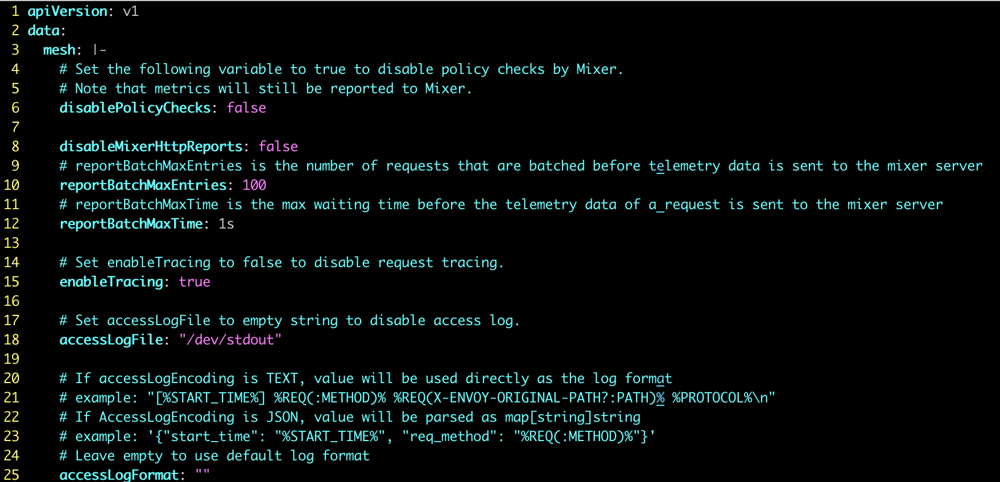

<!-- toc -->
# istio 的配置参数

istio 的配置参数非常非常多！

## 部署时调整参数的方法

用 [helm](./demo-install.md) 部署时，通过 --set 设置，如下：

```sh
$ kubectl create namespace istio-system
$ helm template install/kubernetes/helm/istio-init \
  --name istio-init \
  --namespace istio-system \
  --set gateways.istio-ingressgateway.type=NodePort \
  | kubectl apply -f -
```

istioctl 查看要使用的部署文件和配置参数：

```sh
$ ./istioctl manifest generate
$ ./istioctl profile dump demo    # 查看 demo 模式的配置
```

istioctl 部署时修改参数的方法：

```sh
$ istioctl manifest apply --set values.global.mtls.enabled=true \
             --set values.global.controlPlaneSecurityEnabled=true
```

istioctl 支持多种 profile，在部署时用 profile 指定：

```sh
# istioctl 支持的 profile
$ ./istioctl profile list
Istio configuration profiles:
    default
    demo
    minimal
    remote
    sds

# istioctl 部署时指定 demo 模式
$ ./istioctl manifest apply --set profile=demo
```

istioctl 的更多用法见 [istioctl usage][2]。

## 运行中调整参数的方法

要在运行中调整运行参数，先要知道 istio 的配置参数存放在哪里。istio 的文档中没有明确说明，通过上下文以及相关操作命令判断，istio 的配置参数都在 configmap 中：

```sh
$ kubectl -n istio-system get configmap
NAME                                                                 DATA   AGE
istio                                                                2      3d23h
istio-crd-10                                                         1      3d23h
istio-crd-11                                                         1      3d23h
istio-crd-14                                                         1      3d23h
istio-galley-configuration                                           1      3d23h
istio-grafana                                                        2      3d23h
istio-grafana-configuration-dashboards-citadel-dashboard             1      3d23h
istio-grafana-configuration-dashboards-galley-dashboard              1      3d23h
istio-grafana-configuration-dashboards-istio-mesh-dashboard          1      3d23h
istio-grafana-configuration-dashboards-istio-performance-dashboard   1      3d23h
istio-grafana-configuration-dashboards-istio-service-dashboard       1      3d23h
istio-grafana-configuration-dashboards-istio-workload-dashboard      1      3d23h
istio-grafana-configuration-dashboards-mixer-dashboard               1      3d23h
istio-grafana-configuration-dashboards-pilot-dashboard               1      3d23h
istio-grafana-custom-resources                                       2      3d23h
istio-security                                                       1      3d23h
istio-security-custom-resources                                      2      3d23h
istio-sidecar-injector                                               2      3d23h
kiali                                                                1      3d23h
prometheus                                                           1      3d23h
```

istioctl 命令可以操作 configmap，例如 [istio enabling-policy][3] 中的操作：

```sh
# 查看当前配置项
$ kubectl -n istio-system get cm istio -o jsonpath="{@.data.mesh}" | grep disablePolicyChecks
disablePolicyChecks: true

# 修改配置项
$ istioctl manifest apply --set values.global.disablePolicyChecks=false
configmap "istio" replaced

# 查看修改后的配置项
$ kubectl -n istio-system get cm istio -o jsonpath="{@.data.mesh}" | grep disablePolicyChecks
disablePolicyChecks: false
```

## 配置参数的含义

这个让人头大，istio 的组件多、配置参数多！

还好 configmap 中有注释，除了逐个研究，没有其它方法：



## 参考

1. [李佶澳的博客][1]

[1]: https://www.lijiaocn.com "李佶澳的博客"
[2]: https://istio.io/docs/setup/install/istioctl/ "istioctl usage"
[3]: https://istio.io/docs/tasks/policy-enforcement/enabling-policy/ "istio enabling-policy"
