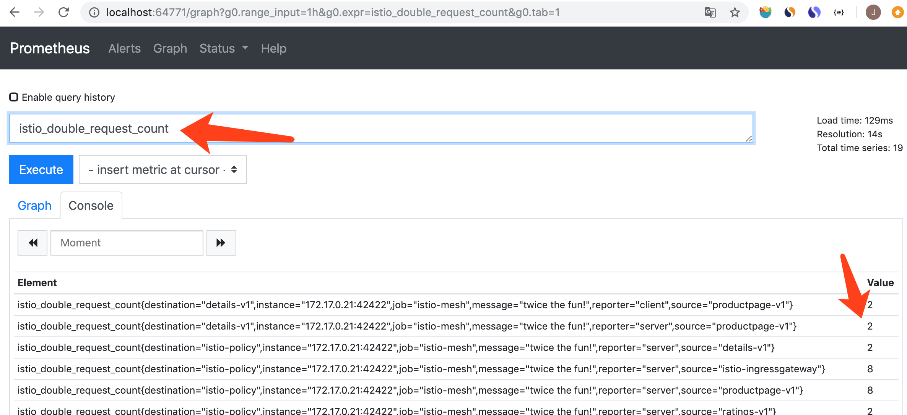

<!-- toc -->
# istio 服务运行指标的采集和查看

服务的运行指标要先配置然后才能生成。首先在 istio 中定义一个指标、然后定义指标的收集方式，最后定义指标的收集规则，之后就可以在 istio 中看到采集的指标，参考 [Collecting Metrics][2]。

下面操作在 [Bookinfo Application](./bookinfo.md) 的基础上进行。

## 创建指标并收集

metrics.yaml 包含了所有需要的配置：

```sh
$ kubectl apply -f samples/bookinfo/telemetry/metrics.yaml
instance.config.istio.io/doublerequestcount created
handler.config.istio.io/doublehandler created
rule.config.istio.io/doubleprom created
```

### 指标定义

定义名为 doublerequestcount 的指标，instance 规定了指标的生成方法，dimensions 定义了指标的属性和属性值（属性值中可以引用 envoy 和 mixer 生成的属性） ：

```yaml
# Configuration for metric instances
apiVersion: config.istio.io/v1alpha2
kind: instance
metadata:
  name: doublerequestcount
  namespace: istio-system
spec:
  compiledTemplate: metric
  params:
    value: "2" # count each request twice
    dimensions:
      reporter: conditional((context.reporter.kind | "inbound") == "outbound", "client", "server")
      source: source.workload.name | "unknown"
      destination: destination.workload.name | "unknown"
      message: '"twice the fun!"'
    monitored_resource_type: '"UNSPECIFIED"'
```

doublerequestcount 有个四个属性：reporter、source、destination 和 message。

value 是指标的值，这里固定为 2，每次请求都会生成一个带有四个属性、值为 2 的指标。

### 收集器定义

收集器定义指标的存放位置和需要存放的属性：

```yaml
# Configuration for a Prometheus handler
apiVersion: config.istio.io/v1alpha2
kind: handler
metadata:
  name: doublehandler
  namespace: istio-system
spec:
  compiledAdapter: prometheus
  params:
    metrics:
    - name: double_request_count # Prometheus metric name
      instance_name: doublerequestcount.instance.istio-system # Mixer instance name (fully-qualified)
      kind: COUNTER
      label_names:
      - reporter
      - source
      - destination
      - message
```

doublehandler 的意思是在 prometheus 中存放 doublerequestcount 指标时，把指标的四个属性设置为 prometheus 中的 label，把 doublerequestcount 指标的值累加（COUNTER 类型）。

结合前面的指标定义， 每个 doublerequestcount 的指标值是 2，每产生一个请求就累加 2，所以这个指标的含义就是“请求发生次数 * 2”。

### 设定采集动作

最后是设定采集动作，将 instance 绑定到 handler：

```yaml
# Rule to send metric instances to a Prometheus handler
apiVersion: config.istio.io/v1alpha2
kind: rule
metadata:
  name: doubleprom
  namespace: istio-system
spec:
  actions:
  - handler: doublehandler
    instances: [ doublerequestcount ]
```

上面的动作意思是：把 doublerequestcount 指标存放到 doublehandler。

## 采集效果

用 [istio操作命令](./command.md) 提供的方法打开 prometheus：

```sh
$ ./istioctl d prometheus
http://localhost:49226
```

刷新几次 bookinfo 网页后，就能在 Prometheus 查询前面创建的指标，名称为 istio_double_request_count，istio_ 是默认前缀：



## 参考

1. [李佶澳的博客][1]

[1]: https://www.lijiaocn.com "李佶澳的博客"
[2]: https://istio.io/docs/tasks/observability/metrics/collecting-metrics/ "Collecting Metrics"
