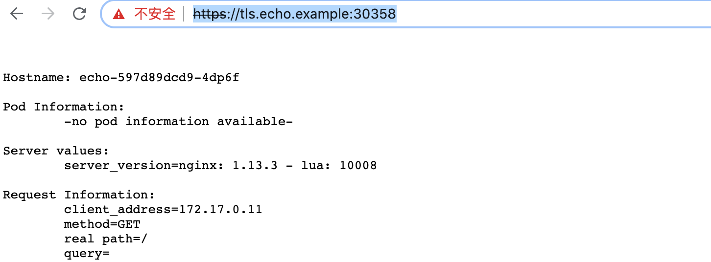

<!-- toc -->
# ingress-nginx 设置 https 证书

ingress-nginx 设置 https 证书的方式特别简单，将目标服务的 tls 证书以 secret 的方式存放到 kubernetes  后，在对应的 ingress 的 tls 设置中引用证书即可。

## 准备证书

目标服务的正式证书要通过 CA 机构签署，试验该功能时可以先用自签署的证书：

```sh
echo "生成自签署的 ca 证书"
openssl req -x509 -sha256 -newkey rsa:4096 -keyout ca.key -out ca.crt -days 3560 -nodes -subj '/CN=My Cert Authority'

echo "生成用上述 ca 签署的 server 证书"
openssl req -new -newkey rsa:4096 -keyout server.key -out server.csr -nodes -subj '/CN=tls.echo.example'
openssl x509 -req -sha256 -days 3650 -in server.csr -CA ca.crt -CAkey ca.key -set_serial 01 -out server.crt
```

CN 是目标服务要使用的域名。

只需要将 server 证书上传到 kubernetes：

```sh
$ kubectl -n demo-echo create secret generic tls-echo-exmaple-secret --from-file=tls.crt=server.crt --from-file=tls.key=server.key
```

## 配置 ingress

ignress 中的 host 一定要与证书的 CN 相同，在 tls 配置中引用前面创建的 secret：

```yaml
apiVersion: extensions/v1beta1
kind: Ingress
metadata:
  name: ingress-echo-with-tls
spec:
  rules:
  - host: tls.echo.example
    http:
      paths:
      - path: /
        backend:
          serviceName: echo
          servicePort: 80
  tls:
  - hosts:
    - tls.echo.example
    secretName: tls-echo-exmaple-secret
```

创建：

```sh
$ kubectl -n demo-echo create -f tls-echo-example-ingress.yaml
```

## 效果

这里的 ingress-nginx 的 IP 地址是 192.168.99.100，https 端口是 30358，在本地配置 hosts：

```sh
# /etc/hosts
192.168.99.100 tls.echo.example
```

因为是自签署的证书，浏览器会提示证书不可信，使用 CA 机构签署证书不会有这个问题：



## 支持多个域名

可以在一个 ingress 中为多个域名设置 tls 加密，例如：

```yaml
apiVersion: extensions/v1beta1
kind: Ingress
metadata:
  name: foo-tls
  namespace: default
spec:
  tls:
  - hosts:
    - foo.bar.com
    # This secret must exist beforehand
    # The cert must also contain the subj-name foo.bar.com
    # https://github.com/kubernetes/ingress-nginx/blob/master/docs/examples/PREREQUISITES.md#tls-certificates
    secretName: foobar
  - hosts:
    - bar.baz.com
    # This secret must exist beforehand
    # The cert must also contain the subj-name bar.baz.com
    # https://github.com/kubernetes/ingress-nginx/blob/master/docs/examples/PREREQUISITES.md#tls-certificates
    secretName: barbaz
  rules:
  - host: foo.bar.com
    http:
      paths:
      - backend:
          serviceName: http-svc
          servicePort: 80
        path: /
  - host: bar.baz.com
    http:
      paths:
      - backend:
          serviceName: nginx
          servicePort: 80
        path: /
```

## 参考

1. [李佶澳的博客][1]

[1]: https://www.lijiaocn.com "李佶澳的博客"
[2]: https://kubernetes.github.io/ingress-nginx/user-guide/tls/ ""
