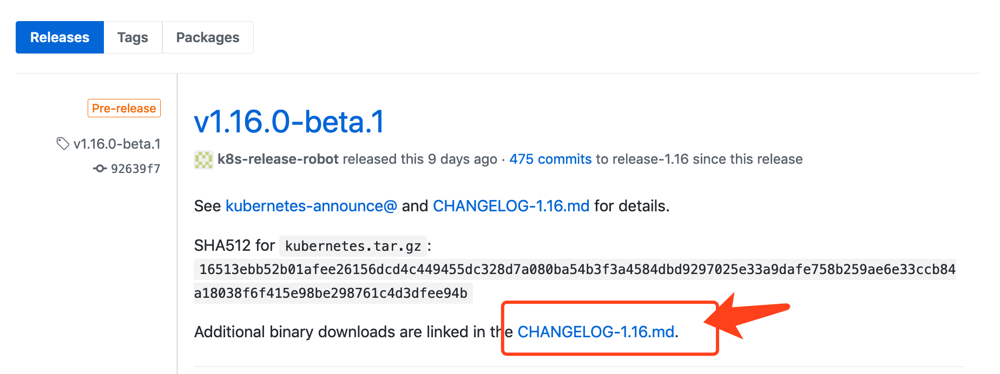
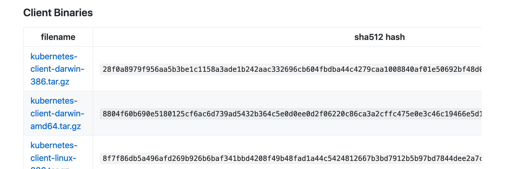

<!-- toc -->
# 安装 Minikube

Minikube 的安装非常简单，可以用 yum、brew 等工具安装，也可以直接从 [github][1] 上下载二进制文件：

['
  cache          Add or delete an image from the local cache.

Configuration and Management Commands:
  addons         Modify minikube's kubernetes addons
  config         Modify minikube config
 ...（省略）...
```

## 安装虚拟化软件

除非在 Linux 上使用 baremetal 的方式，否则需要安装虚拟化软件，使用 virtualbox、vmware 等最常用的虚拟机化软件即可。Minikube 默认虚拟化软件为 virtualbox。

## 安装 kubectl

要操作部署的 kubernetes，本地还需要有 kubectl 命令，可以到 [kubernetes/releases][2] 中下载。

[][2]

点击 ChangeLog 文件进入下载页面：

[][3]

## 参考

[1]: https://github.com/kubernetes/minikube/releases "kubernetes/minikube/releases"
[2]: https://github.com/kubernetes/kubernetes/releases "kubernetes/releases"
[3]: https://github.com/kubernetes/kubernetes/blob/master/CHANGELOG-1.16.md#downloads-for-v1160-beta1  "CHANGELOG-1.16.md"
