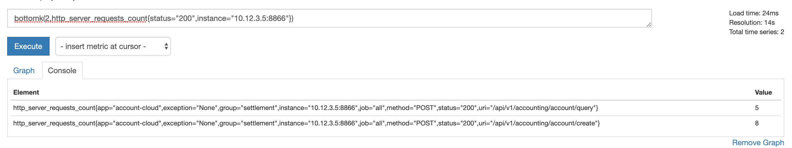

# Prometheus 查询结果的聚合运算

聚合运算符形态上与函数类似，用于分析查询得到的数据集：

```sh
sum:    求和
min:    最小值
max:    最大值
avg:    平均值
stddev: 标准方差（stdvar的平方根）
stdvar: 标准平方差
count:  计数
count_values: 统计每个值出现的次数
bottomk: 取结果中最小的 k 位数
topk:    取结果中最大的 k 位数
quantile: 取分位数 (0 ≤ φ ≤ 1）
```

聚合运算符使用方式如下，部分聚合运算符需要输入参数（parameter），例如 count_values、bottomk、topk 、quantile：

```sh
<aggr-op>([parameter,] <vector expression>) [without|by (<label list>)]
```

## 统计每个值出现的次数

统计每个值出现的次数，参数为结果中的字符串名称：

```sh
count_values("str",http_server_requests_count{status="200",instance="10.12.3.5:8866"})
```


## 取前 k 位/后 k 位

取结果中最小（bottomk）和最大（topk）的 k 位数，参数为 k：

```sh
bottomk(2,http_server_requests_count{status="200",instance="10.12.3.5:8866"})
topk(2,http_server_requests_count{status="200",instance="10.12.3.5:8866"})
```



## 取分位数

取第 0.3 分位数，输入参数为分位位置：

```sh
quantile(0.3,http_server_requests_count{status="200",instance="10.12.3.5:8866"})
```


