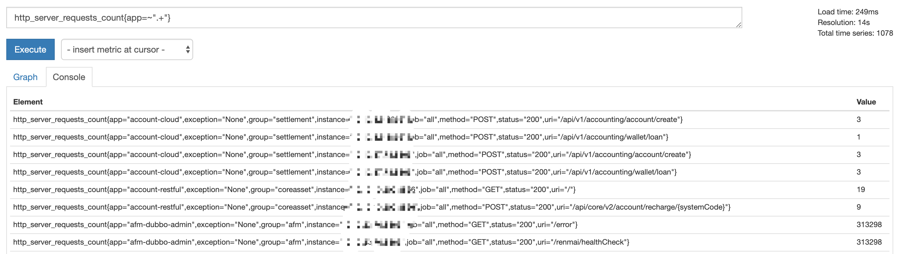
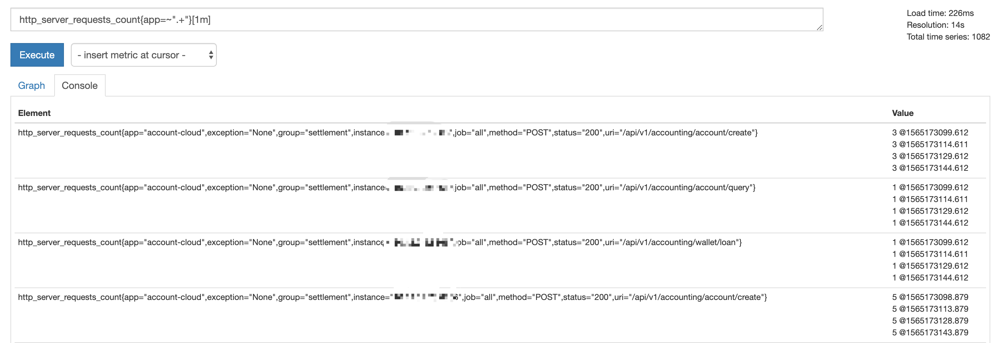

# Prometheus 的查询语句

Prometheus 的数据查询语句叫做 Prometheus Query Language，提供了不少查询函数，表达能力比较丰富。
语句的执行结果有四种类型：

* Scalar: 浮点数值
* String: 字符串（预留类型，当前没有实现 2019-08-07 18:04:55）
* Instant vector：瞬时值数组，从不同采集地址采集到的同一指标的当前值组成的数组
* Range vector: 区间数组，从不同采集地址采集到的同一指标在一段时间的内数值组成的数组

前两种类型容易理解，Instant vector 和 Range vector 的有区别前者是一个一个当前值组成的数组，后者是一段区间里的数值组成的数组，继续组成的数组，一看便知：

**Instant vector**：

**Range vector**

## 参考
