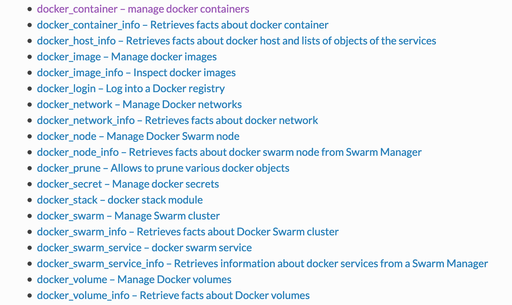

<!-- toc -->

# 使用 ansible 操作目标机器上的容器

docker 的安装方法见 [docker 的安装](../docker/install.md)。



## 用 ansible 安装 docker（CentOS）

在 tasks/main.yml 中写入：

```yaml
- name: Download docker repo
  get_url:
    url: https://download.docker.com/linux/centos/docker-ce.repo
    dest: /etc/yum.repos.d/docker-ce.repo

- name: Install docker
  notify: Start docker
  yum:
    name: docker-ce
    state: installed
```
 
在 handlers/main.yml 中写入：

```yaml
- name: Start docker
  systemd:
    name: docker
    state: started
    daemon_reload: yes
    enabled: yes
```

## 用 ansible 启动容器

[docker_container][1] 模块用来启停容器：

```yaml
- name: Start pushgateway container
  docker_container:
    state: started
    name:  pushgateway-v0.9.1
    image: prom/pushgateway:v0.9.1
    ports:
     - "9091:9091"
```

可能会遇到下面的错误：

```sh
TASK [pushgateway : Start pushgateway container] ***********************************************************************************************************************************************************
fatal: [10.19.11.7]: FAILED! => {"ansible_facts": {"discovered_interpreter_python": "/usr/bin/python"}, "changed": false, "msg": "Failed to import docker or docker-py (Docker SDK for Python) - No module named requests.exceptions. Try `pip install docker` or `pip install docker-py` (Python 2.6)."}
fatal: [10.19.117.30]: FAILED! => {"ansible_facts": {"discovered_interpreter_python": "/usr/bin/python"}, "changed": false, "msg": "Failed to import docker or docker-py (Docker SDK for Python) - No module named requests.exceptions. Try `pip install docker` or `pip install docker-py` (Python 2.6)."}
```

遇到这种情况，需要在 `目标机器` 上安装 docker 的 python 包：

```yaml
- name: Install pip
  yum:
    name: python2-pip
    state: installed
- name: Install docker python lib
  pip:
    name: docker
- name: Start pushgateway container
  docker_container:
    state: started
    name:  pushgateway-v0.9.1
    image: prom/pushgateway:v0.9.1
    ports:
     - "9091:9091"
```

## 参考

[1]: https://docs.ansible.com/ansible/latest/modules/docker_container_module.html#examples "docker_container"
