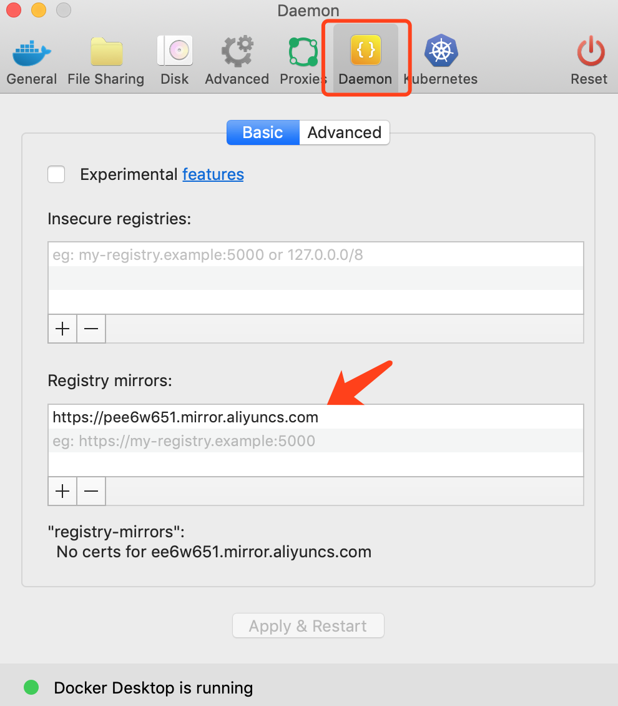

<!-- toc -->

# Docker 安装部署

docker、docker-ce 和 docker-ee 的关系见 [moby、docker-ce与docker-ee][2]。

推荐使用 docker-ce。

## CentOS - 安装 docker-ce

添加 docker-ce 的源，安装 docker-ce：

```sh
wget https://download.docker.com/linux/centos/docker-ce.repo
mv docker-ce.repo /etc/yum.repos.d
yum install -y docker-ce
```

启动：

```sh
systemctl start docker
```

## 配置阿里云镜像

docker 的镜像服务器在境外，从国内拉取镜像会特别慢。给 docker 配置一个国内的镜像源可以大大缩短镜像的获取时间。

在 /etc/docker/daemon.json 中添加下面的配置，如果该文件不存在则创建， 然后重启 docker：

```json
{
  "registry-mirrors" : [
    "https://pee6w651.mirror.aliyuncs.com"
  ]
}
```

如果是有图形界面的 docker 更简单：



## 参考

1. [李佶澳的博客][1]

[1]: https://www.lijiaocn.com "李佶澳的博客"
[2]: https://www.lijiaocn.com/%E9%A1%B9%E7%9B%AE/2017/07/18/docker-commnuity.html "moby、docker-ce与docker-ee"
