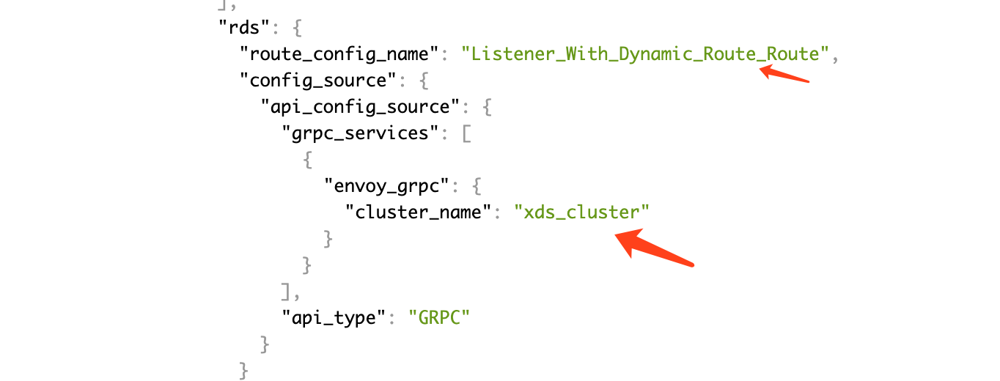
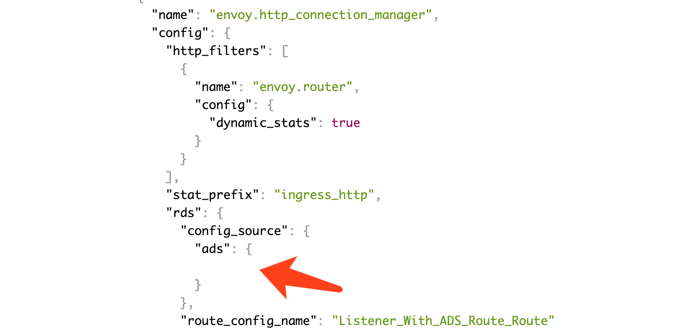

<!-- toc -->

>视频讲解：[Envoy手把手入门视频讲解](https://study.163.com/course/courseMain.htm?share=2&shareId=400000000376006&courseId=1209487865&_trace_c_p_k2_=18c88dad391f427b9e40e0795d8d939d)

# go-control-plane 下发配置示例—运行和效果


这里详细演示动态配置的几种组合，使用的 envoy 配置文件是 envoy-1-ads-with-xds.yaml。

启动 envoy：

```sh
./run.sh envoy-1-ads-with-xds.yaml
```

## envoy 初始状态

envoy 启动之后，通过 admin 地址（浏览器打开 IP:9901 ） 查看 envoy 的当前配置以及内部情况：


envoy 的当前配置通过 IP:9901/config_dump 查看，通过该地址查询的配置文件是分为几段的：

* 第一段为 "@type": "type.googleapis.com/envoy.admin.v2alpha.BootstrapConfigDump"，是 envoy 启动时的配置
* 第二段为 "@type": "type.googleapis.com/envoy.admin.v2alpha.ClustersConfigDump"，是 cluster 配置，这里现在只有静态配置的 ads_cluster
* 第三段为 "@type": "type.googleapis.com/envoy.admin.v2alpha.ListenersConfigDump"，第三段现在是空的


下发 listener 和 route 后会多出两段配置，里面是动态下发的 route：

* "@type": "type.googleapis.com/envoy.admin.v2alpha.ScopedRoutesConfigDump" 
* "@type": "type.googleapis.com/envoy.admin.v2alpha.RoutesConfigDump" 


endpoint 在配置页面中看不到，要到 IP:9901/clusters 中查看：


## 启动控制平面

演示实现的控制平面的功能如下，每按一次回车，下发一组配置：

```sh
$ ./xds
Enter to update version 1: Cluster_With_Static_Endpoint
ok
Enter to update version 2: Cluster_With_Dynamic_Endpoint
ok
Enter to update version 3: Cluster_With_ADS_Endpoint
ok
Enter to update version 4: Listener_With_Static_Route
ok
Enter to update version 5: Listener_With_Dynamic_Route
ok
Enter to update version 6: Listener_With_ADS_Route
ok
Enter to exit: ^C
```

## 使用静态 endpoint 的 cluster

```go
{
    clusterName := "Cluster_With_Static_Endpoint"
    fmt.Printf("Enter to update version 1: %s", clusterName)
    _, _ = fmt.Scanf("\n", &input)

    var addrs []ADDR
    addrs = append(addrs, ADDR{
        Address: "127.0.0.1",
        Port:    8081,
    })
    cluster := Cluster_STATIC(clusterName, addrs)
    node_config.clusters = append(node_config.clusters, cluster)
    Update_SnapshotCache(snapshotCache, node_config, "1")
    fmt.Printf("ok")
}
```

下发后多出一个名为  Cluster_With_Static_Endpoint 的 cluster，地址为 127.0.0.1:8081。


## 使用 eds 发现 endpoint 的 cluster

```go
{
    clusterName := "Cluster_With_Dynamic_Endpoint"

    fmt.Printf("\nEnter to update version 2: %s", clusterName)
    _, _ = fmt.Scanf("\n", &input)

    var addrs []ADDR
    addrs = append(addrs, ADDR{
        Address: "127.0.0.1",
        Port:    8082,
    })

    point := EDS(clusterName, addrs)
    node_config.endpoints = append(node_config.endpoints, point)

    var edsCluster []string
    edsCluster = append(edsCluster, "xds_cluster") //静态的配置的 cluster

    edsName := clusterName
    cluster := Cluster_EDS(clusterName, edsCluster, edsName)
    node_config.clusters = append(node_config.clusters, cluster)

    Update_SnapshotCache(snapshotCache, node_config, "2")
    fmt.Printf("ok")
}
```

下发后多出一个名为 Cluster_With_Dynamic_Endpoint 的 cluster，地址为 127.0.0.1:8082。


cluster 中没有直接配置 endpoint，指定从 xds_cluster 中获取，在 IP:9901/clusters 中可以看到 endpoint：


## 使用 ads 发现 endpoint 的 cluster

```go
{
    clusterName := "Cluster_With_ADS_Endpoint"
    fmt.Printf("\nEnter to update version 3: %s", clusterName)
    _, _ = fmt.Scanf("\n", &input)

    var addrs []ADDR
    addrs = append(addrs, ADDR{
        Address: "127.0.0.1",
        Port:    8083,
    })

    edsName := clusterName
    point := EDS(edsName, addrs)
    node_config.endpoints = append(node_config.endpoints, point)

    cluster := Cluster_ADS("Cluster_With_ADS_Endpoint")
    node_config.clusters = append(node_config.clusters, cluster)

    Update_SnapshotCache(snapshotCache, node_config, "3")
    fmt.Printf("ok")
}
```

下发后多出一个名为 Cluster_With_ADS_Endpoint 的 cluster，地址为 127.0.0.1:8083。

ads 的配置和 xds 不同，不需要指定 cluster，声明使用 ADS 即可：


## 使用静态路由的 listener

前面的几个步骤下发了 cluster，没有下发 listener，无法访问 cluster，要访问 cluster 必须配置一个指向它的 listener。

```go
{
    listenerName := "Listener_With_Static_Route"
    fmt.Printf("\nEnter to update version 4: %s", listenerName)
    _, _ = fmt.Scanf("\n", &input)

    clusterName := "Listener_With_Static_Route_Target_Cluster"
    var addrs []ADDR
    addrs = append(addrs, ADDR{
        Address: "127.0.0.1",
        Port:    8080,
    })
    cluster := Cluster_STATIC(clusterName, addrs)
    node_config.clusters = append(node_config.clusters, cluster)

    lis := Listener_STATIC(listenerName, 84, "echo.example", "/abc", clusterName)
    node_config.listeners = append(node_config.listeners, lis)

    Update_SnapshotCache(snapshotCache, node_config, "4")
    fmt.Printf("ok")
}
```

上面的代码下发了一个监听 84 端口、将请求转发到 172.17.0.2:8080 的 listener，转发规则为 Host 是 echo.example，prefix 是 /abc：
这里的 172.17.0.2:8080，是 [初次体验](./echoserver.md) 中启动的 echoserver 容器的地址。

下发以后，在管理界面可以看到下面的配置：


这时候可以通过 84 端口访问 cluster：

```sh
$ curl   -H "Host: echo.example" 127.0.0.1:84/abc

Hostname: 7759cabd7402

Pod Information:
	-no pod information available-

Server values:
	server_version=nginx: 1.13.3 - lua: 10008

Request Information:
	client_address=172.17.0.3
	method=GET
	real path=/abc
	query=
	request_version=1.1
	request_scheme=http
	request_uri=http://echo.example:8080/abc

Request Headers:
	accept=*/*
	content-length=0
	host=echo.example
	user-agent=curl/7.54.0
	x-envoy-expected-rq-timeout-ms=15000
	x-forwarded-proto=http
	x-request-id=8bda7006-87dd-4251-ad3a-431d610ef806

Request Body:
	-no body in request-
```

## 使用 xds 发现路由的 listener

```go
{
	listenerName := "Listener_With_Dynamic_Route"
	fmt.Printf("\nEnter to update version 5: %s", listenerName)
	_, _ = fmt.Scanf("\n", &input)

	clusterName := "Listener_With_Dynamic_Route_Target_Cluster"
	var addrs []ADDR
	addrs = append(addrs, ADDR{
		Address: "172.17.0.2",
		Port:    8080,
	})
	cluster := Cluster_STATIC(clusterName, addrs)
	node_config.clusters = append(node_config.clusters, cluster)

	routeName := "Listener_With_Dynamic_Route_Route"
	r := Route(routeName, "echo.example", "/123", clusterName)
	node_config.routes = append(node_config.routes, r)

	var rdsCluster []string
	rdsCluster = append(rdsCluster, "xds_cluster") //静态的配置的 cluster
	lis := Listener_RDS(listenerName, 85, routeName, rdsCluster)
	node_config.listeners = append(node_config.listeners, lis)

	Update_SnapshotCache(snapshotCache, node_config, "5")
	fmt.Printf("ok")
}
```

上面代码中 rds 配置的是 xds_cluster，xds_cluster 是配置文件中事先配置的静态 cluster：



## 使用 ads 发现路由的 listener

```go
{
	listenerName := "Listener_With_ADS_Route"
	fmt.Printf("\nEnter to update version 6: %s", listenerName)
	_, _ = fmt.Scanf("\n", &input)

	clusterName := "Listener_With_ADS_Route_Target_Cluster"
	var addrs []ADDR
	addrs = append(addrs, ADDR{
		Address: "172.17.0.2",
		Port:    8080,
	})
	cluster := Cluster_STATIC(clusterName, addrs)
	node_config.clusters = append(node_config.clusters, cluster)

	routeName := "Listener_With_ADS_Route_Route"
	r := Route(routeName, "echo.example", "/a1b", clusterName)
	node_config.routes = append(node_config.routes, r)

	lis := Listener_ADS(listenerName, 86, routeName)
	node_config.listeners = append(node_config.listeners, lis)

	Update_SnapshotCache(snapshotCache, node_config, "6")
	fmt.Printf("ok")
}
```

上面代码中 rds 配置的是 ads，ads 指向配置文件中事先配置的 ads_cluster：



## 参考

[1]: https://github.com/introclass/go-code-example/tree/master/envoydev/xds  "github.com/introclass/go-code-example/envoydev/xds"
[2]: https://github.com/introclass/go-code-example/blob/master/envoydev/xds/envoy-docker-run/envoy-0-example.yaml "envoy-0-example.yaml"
[3]: https://github.com/introclass/go-code-example/blob/master/envoydev/xds/xds.go "xds.go"
