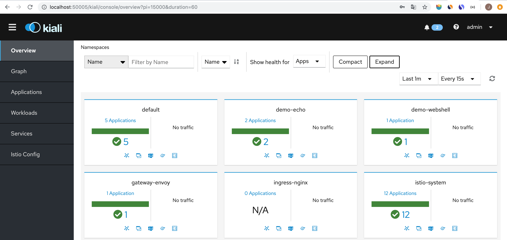
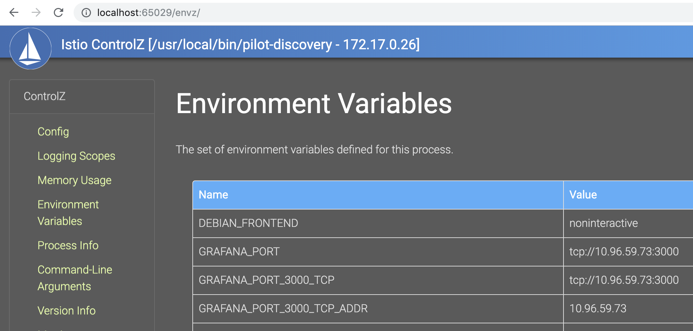
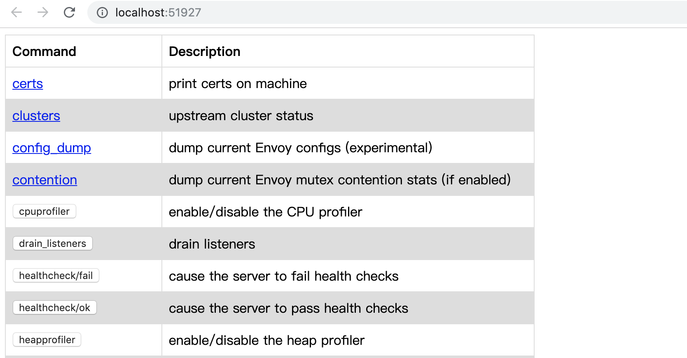
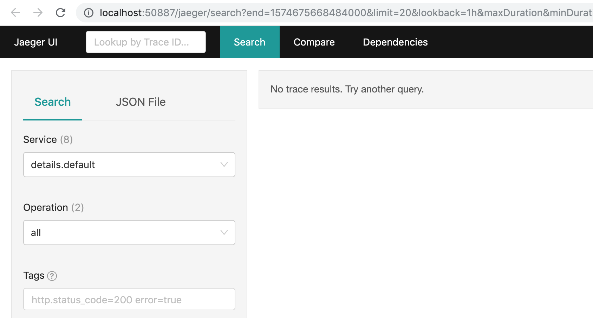
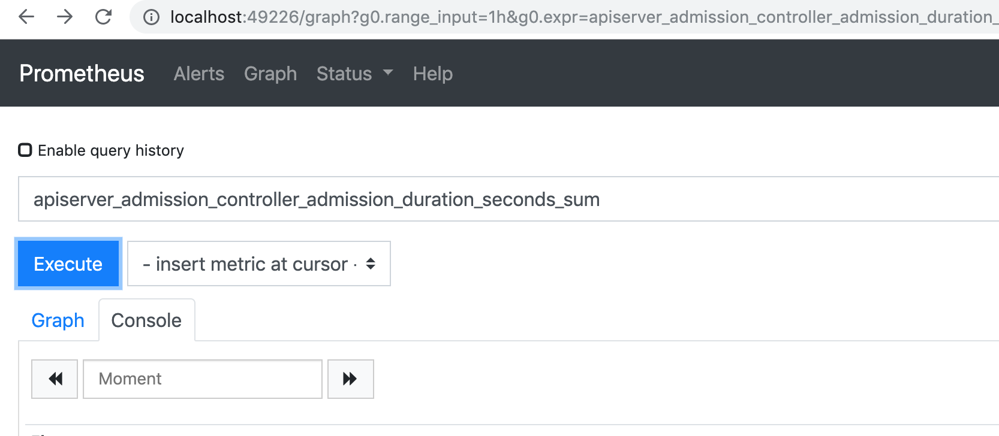
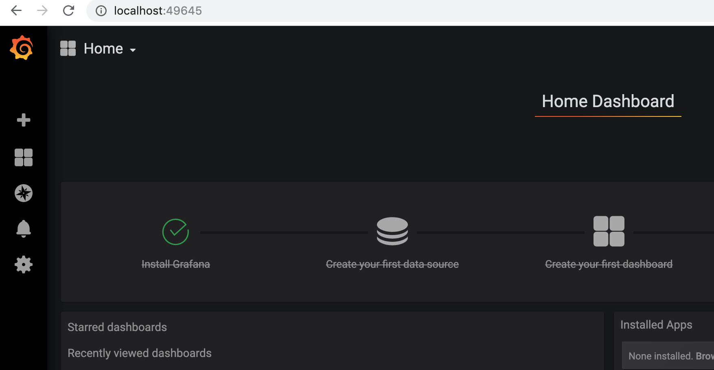

<!-- toc -->
# istio 操作命令

[istioctl][2]  是 istio 的管理命令，用来部署、管理、调试、诊断。istioctl 管理的是部署在 kubernetes 中的 istio，它通过读取本地的 kubeconfig context，获取的 kubernetes 的地址以及操作权限。

istioctl 命令位于 istio-1.4.0/bin 中，有多个子命令：

```sh
--context <string>                 The name of the kubeconfig context to use (default ``)
--istioNamespace <string>    -i    Istio system namespace (default `istio-system`)
...
```

## istio 提供的 Web 页面

istio 内置了一些 web 页面，可以用 `istioctl dashboard` 命令打开。 

```sh
$ ./istioctl help dashboard
Access to Istio web UIs

Usage:
  istioctl dashboard [flags]
  istioctl dashboard [command]

Aliases:
  dashboard, dash, d

Available Commands:
  kiali       Open Kiali web UI
  controlz    Open ControlZ web UI
  envoy       Open Envoy admin web UI
  jaeger      Open Jaeger web UI
  prometheus  Open Prometheus web UI
  grafana     Open Grafana web UI
  zipkin      Open Zipkin web UI
```

### kiali，可视化页面

kiali 是 istio 内置的可视化页面：

```sh
$ ./istioctl d kiali
http://localhost:50005/kiali
```



### controlz，配置文件

打开配置页面，istio 的配置用 pilot 组件管理的，打开配置页面时，需要指定 pilot 容器：

```sh
$ ./istioctl dashboard  controlz istio-pilot-785bc88559-jjzvl -n istio-system
```



### envoy，打开指定 envoy 的管理页面

istio 为网格内的每个容器注入了一个 envoy 容器，同时提供打开每个 envoy 的 admin 页面方法：

```sh
$ ./istioctl d envoy  ratings-v1-779cf974b6-fxmk8
http://localhost:51927
```

我们可以通过 envoy 的 admin 页面查看 envoy 中规则，envoy 用法参考 [envoy 使用手册](../envoy/index.md)。



### jaejer，调用链

istio 支持 jaejer 和 zipkin。

```sh
$ ./istioctl d jaeger
http://localhost:50887
```



### prometheus，监控数据

打开 prometheus 页面：

```sh
$ ./istioctl d prometheus
http://localhost:49226
```



### grafana，监控数据

打开 grafana 页面：

```sh
$ ./istioctl d grafana
http://localhost:49645
```



## 参考

1. [李佶澳的博客][1]

[1]: https://www.lijiaocn.com "李佶澳的博客"
[2]: https://istio.io/docs/reference/commands/istioctl/ "istioctl"
