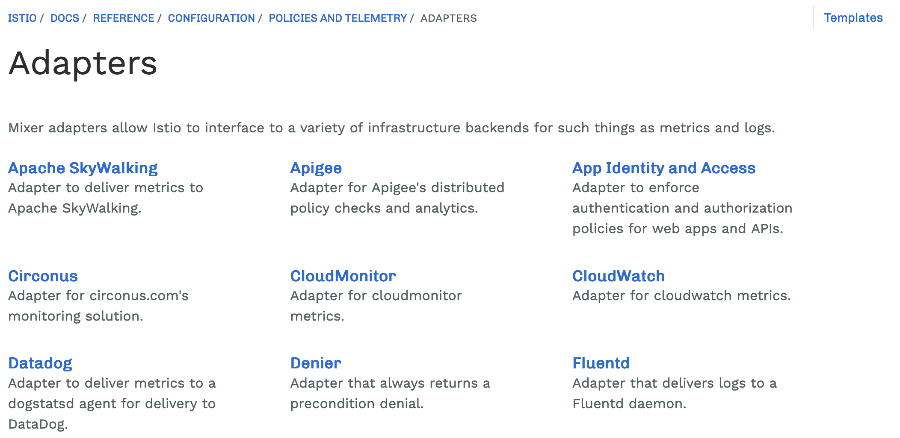
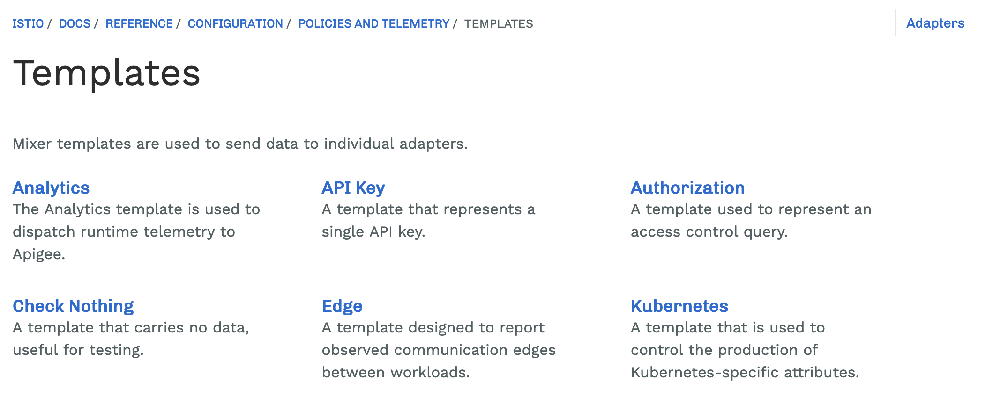
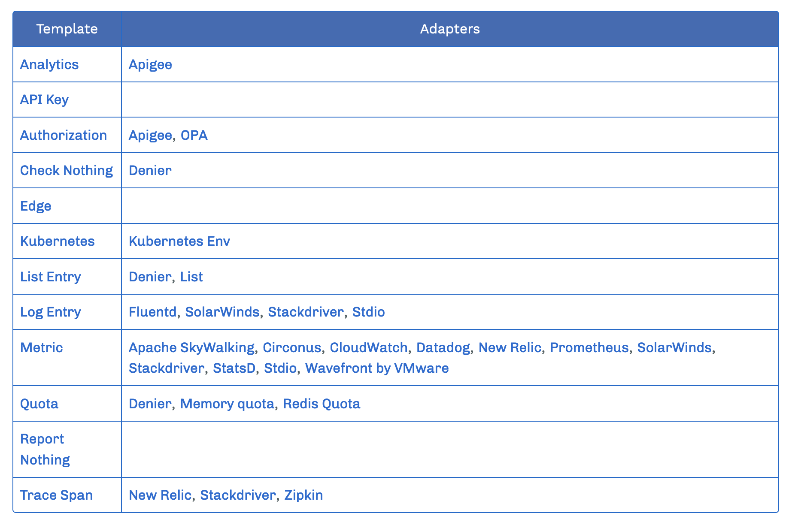
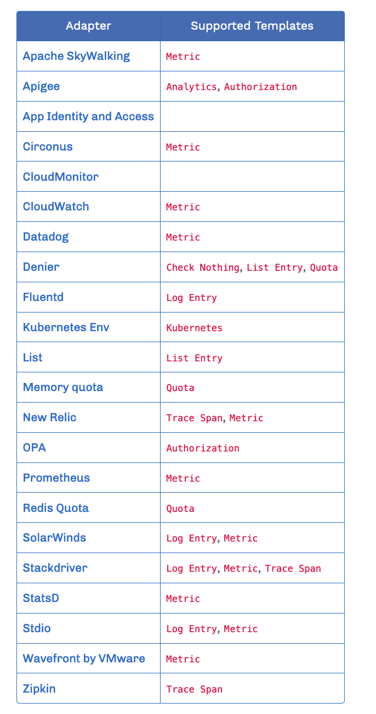

<!-- toc -->
# istio 的功能类别和基本概念

## istio 的功能类别

istio 的功能分为四类：

* 流量管理，[Traffic Management](https://istio.io/docs/concepts/traffic-management/)
* 认证加密，[Security](https://istio.io/docs/concepts/security/)
* 访问策略，[Policies](https://istio.io/docs/concepts/policies/)
* 全局监控，[Observability](https://istio.io/docs/concepts/observability/)


## istio 的基本概念

istio 的规则配置主要围绕下面的概念进行：

* [VirtualService](./vsvc.md)， 转发规则
* [DestinationRule](./dstrule.md)，均衡策略
* [Gateway](./gateway.md)，对外服务
* [ServiceEntry](./entry.md)，封装外部服务
* [Engress Control](./egress.md), 一种管控外出请求的方法

如果非要类比的话：

* VirtualService 相当于 nginx 中的 Server
* DestinationRule 相当于 nginx 中的 upstream 
* Gateway 和 ServiceEntry 相当于 kubernetes 中的 ingress 和 endpoints

## istio 的配置模型

istio 定义了大量的 CRD，除了上面的 VirtualService、DestinationRule、Gateway、ServiceEntry，还有[指标采集](./metrics.md) 、[日志收集](./log.md)、[访问限制](./policy.md)、[请求改写](./modify.md) 中用到的 handler、instance、rule。

[Mixer Configuration Model][10] 介绍了 istio 的控制策略和监测度量的配置模型，就是 handler、instance、rule。

### handler 和 adapter 

[handler][11] 主要的用途是配置 [adapter][12]，adapters 是一堆适配器，用来对接 prometheus、fluentd 等其它系统，或者实现名单、标准输出等特殊功能。

istio 内置了很多 [adapters][2]，adapter 有各自的配置参数：



[指标采集](./metrics.md) 使用的对接 prometheus 的 handler，封装了 [adpater prometheus][3]：

```yaml
# Configuration for a Prometheus handler
apiVersion: config.istio.io/v1alpha2
kind: handler
metadata:
  name: doublehandler
  namespace: istio-system
spec:
  compiledAdapter: prometheus
  params:
    metrics:
    - name: double_request_count # Prometheus metric name
      instance_name: doublerequestcount.instance.istio-system # Mixer instance name (fully-qualified)
      kind: COUNTER
      label_names:
      - reporter
      - source
      - destination
      - message
```

[访问限制](./policy.md) 使用了 [adapter list][4]：


```yaml
apiVersion: config.istio.io/v1alpha2
kind: handler
metadata:
  name: whitelistip
spec:
  compiledAdapter: listchecker
  params:
    # providerUrl: ordinarily black and white lists are maintained
    # externally and fetched asynchronously using the providerUrl.
    overrides: ["10.57.0.0/16"]  # overrides provide a static list
    blacklist: false
    entryType: IP_ADDRESSES
```

### instance 和 template

[instance][13] 的用途是将 mixer 获取的各种属性转换成 apdater 的输入，这个过程需要 [templates][6] 介入：

istio 内置了很多 [templates][6]:



[指标采集](./metrics.md) 中用到了 [template metric][7]：

```yaml
# Configuration for metric instances
apiVersion: config.istio.io/v1alpha2
kind: instance
metadata:
  name: doublerequestcount
  namespace: istio-system
spec:
  compiledTemplate: metric
  params:
    value: "2" # count each request twice
    dimensions:
      reporter: conditional((context.reporter.kind | "inbound") == "outbound", "client", "server")
      source: source.workload.name | "unknown"
      destination: destination.workload.name | "unknown"
      message: '"twice the fun!"'
    monitored_resource_type: '"UNSPECIFIED"'
```

### rule：连接 handler 和 instance 

rule 设置 handler 的作用范围，并指定为 handler 提供输入的 instance，将 handler 和 instance 配对。

以 [按标签设置黑白名单](./policy.md) 中的 rule 为例：

```yaml
apiVersion: "config.istio.io/v1alpha2"
kind: rule
metadata:
  name: denyproductpage
spec:
  match: destination.labels["app"] == "http-record" && destination.labels["version"] == "v2" && source.labels["app"]=="productpage"
  actions:
  - handler: denyproductpagehandler
    instances: [ denyproductpagerequest ]
```

上面的配置限定只为从 productpage 到 http-record:v1 的请求，通过 denyproductpagerequest 模板生成状态数据, 作为 denyproductpagehandler 的输入。

instance 和 handler 的定义如下：

```yaml
---
apiVersion: "config.istio.io/v1alpha2"
kind: handler
metadata:
  name: denyproductpagehandler
spec:
  compiledAdapter: denier
  params:
    status:
      code: 7
      message: Not allowed
---
apiVersion: "config.istio.io/v1alpha2"
kind: instance
metadata:
  name: denyproductpagerequest
spec:
  compiledTemplate: checknothing
```

### adapter 和 template 的配对

通过 tempalte 生成的状态数据不能用于所有的 adapter，tempalte 和 adapter 之间有配对关系。

template 适用的 adpaters，[点击查看最新][8]：



adapter 支持的 templates，[点击查看最新][9]：



### instance 和 rule 可以使用的属性和属性表达式

[Attributes][15] 是 istio 的核心概念之一。instance 和 rule 都用到了属性和属性表达式，instance 通过属性表达式生成 handler 的输入，rule 通过属性表达式限定 handler 的作用范围。

istio 支持的所有属性：

* [Attributes Vocabulary][16]

istio 属性表达式语法：

* [Expression Language][17]。

## 自定义 adpater 和 template

istio [请求改写](./modify.md) 中使用了自定义的 adpater 和 template。

## 参考

1. [李佶澳的博客][1]

[1]: https://www.lijiaocn.com "李佶澳的博客"
[2]: https://istio.io/docs/reference/config/policy-and-telemetry/adapters/ "istio adapters"
[3]: https://istio.io/docs/reference/config/policy-and-telemetry/adapters/prometheus/ "adapter prometheus"
[4]: https://istio.io/docs/reference/config/policy-and-telemetry/adapters/denier/ "adapter denier"
[5]: https://istio.io/docs/reference/config/policy-and-telemetry/adapters/list/ "adapter list"
[6]: https://istio.io/docs/reference/config/policy-and-telemetry/templates/  "templates"
[7]: https://istio.io/docs/reference/config/policy-and-telemetry/templates/metric/  "template metric"
[8]: https://istio.io/docs/reference/config/policy-and-telemetry/templates/#adapters  "template 适用的 adpaters"
[9]: https://istio.io/docs/reference/config/policy-and-telemetry/adapters/#templates  "adater 支持的 templates"
[10]: https://istio.io/docs/reference/config/policy-and-telemetry/mixer-overview/ "Mixer Configuration Model"
[11]: https://istio.io/docs/reference/config/policy-and-telemetry/mixer-overview/#handlers "handlers"
[12]: https://istio.io/docs/reference/config/policy-and-telemetry/mixer-overview/#adapters "adpaters"
[13]: https://istio.io/docs/reference/config/policy-and-telemetry/mixer-overview/#instances "Instances"
[14]: https://istio.io/docs/reference/config/policy-and-telemetry/mixer-overview/#rules "Rules'
[15]: https://istio.io/docs/reference/config/policy-and-telemetry/mixer-overview/#attributes "Attributes"
[16]: https://istio.io/docs/reference/config/policy-and-telemetry/attribute-vocabulary/ "Attribute Vocabulary"
[17]: https://istio.io/docs/reference/config/policy-and-telemetry/expression-language/ "Expression Language"

