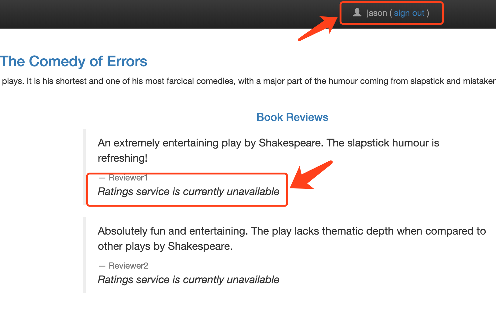

<!-- toc -->
# istio 错误注入功能的使用方法

[Fault Injection][1] 让目标服务以一定的比例返回错误码后者延迟回应，用来测试业务系统的容错能力。

错误注入在 [VirtualService](./vsvc.md) 中配置，VirtualService 支持的注入类型，可以在 [HTTPFaultInjection][5] 中找到。 

下面操作在 [Bookinfo Application](./bookinfo.md) 的基础上进行。

## 返回一定的比例的错误码

[injecting-an-http-abort-fault][3] 演示如何返回一定比例的错误码。

编辑前面创建的名为 reviews 的 VirtualService，在 http 中添加 fault 配置：

```yaml
$ kubectl edit vs ratings
...省略...
spec:
  hosts:
  - ratings
  http:
  - route:
    - destination:
        host: ratings
        subset: v1
  # 添加的 fault 注入，以 100% 的比例返回 500 错误码
  - fault:
      abort:
        httpStatus: 500
        percentage:
          value: 100
    match:
    - headers:
        end-user:
          exact: jason
    route:
    - destination:
        host: ratings
        subset: v1
```

上面配置的 fault 注入只对 jason 用户有效（fault 的 match 中配置的匹配条件，带有 end-user: jason 请求头）。

在 productpage 容器中，用 curl 访问 ratings 服务，带有匹配的 header 时，返回 500：

```sh
$ apt-get install curl
$ curl -H "end-user: jason" http://ratings:9080/ratings/0
...省略...
< HTTP/1.1 500 Internal Server Error
< content-length: 18
< content-type: text/plain
< date: Thu, 21 Nov 2019 07:18:51 GMT
< server: envoy
<
* Curl_http_done: called premature == 0
* Connection #0 to host ratings left intact
```

Productpage 页面会显示 Ratings service is currently unavailable：



通过错误注入，可以非常方便的验证当一个微服务发生故障时，整个应用的运行状态。

## 注入响应延迟

除了注入错误码，还可以延迟响应，制造超时的场景：[injecting-an-http-delay-fault][4]。

## 更多注入类型

* [HTTPFaultInjection][5] 

## 参考

1. [李佶澳的博客][1]

[1]: https://www.lijiaocn.com "李佶澳的博客"
[2]: https://istio.io/docs/tasks/traffic-management/fault-injection/ "Fault Injection"
[3]: https://istio.io/docs/tasks/traffic-management/fault-injection/#injecting-an-http-abort-fault "injecting-an-http-abort-fault"
[4]: https://istio.io/docs/tasks/traffic-management/fault-injection/#injecting-an-http-delay-fault "injecting-an-http-delay-fault"
[5]: https://istio.io/docs/reference/config/networking/virtual-service/#HTTPFaultInjection "HTTPFaultInjection"
