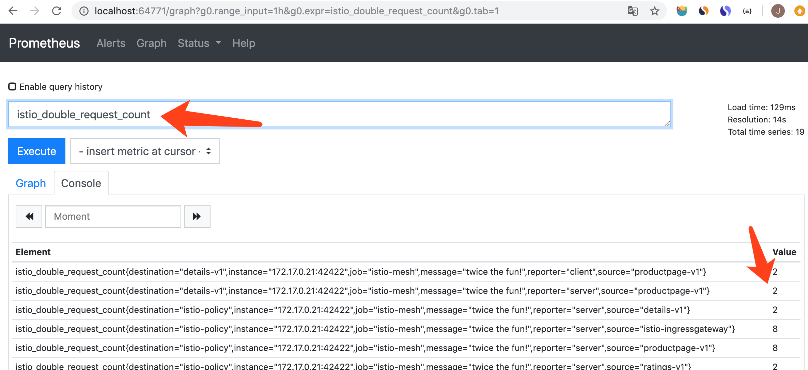

<!-- toc -->
# istio 服务运行指标的采集和查看

服务的运行指标要先配置然后才能生成。首先在 istio 中定义一个指标、然后定义指标的收集方式，最后定义指标的收集规则，之后就可以在 istio 中看到采集的指标，参考 [Collecting Metrics][2]。

下面操作在 [Bookinfo Application](./bookinfo.md) 的基础上进行。

## 创建指标并收集

metrics.yaml 包含了所有需要的配置：

```sh
$ kubectl apply -f samples/bookinfo/telemetry/metrics.yaml
instance.config.istio.io/doublerequestcount created
handler.config.istio.io/doublehandler created
rule.config.istio.io/doubleprom created
```

### 指标数据生成方法

定义名为 doublerequestcount 的指标，instance 规定了指标的生成方法，dimensions 是生成的指标的属性和属性值：

属性值中可以引用 envoy 和 mixer 生成的属性，见 [istio的配置模型](./concept.md)，使用了名为 metric 的 template，见 [instance 和 template](./concept.md)。

```yaml
# Configuration for metric instances
apiVersion: config.istio.io/v1alpha2
kind: instance
metadata:
  name: doublerequestcount
  namespace: istio-system
spec:
  compiledTemplate: metric
  params:
    value: "2" # count each request twice
    dimensions:
      reporter: conditional((context.reporter.kind | "inbound") == "outbound", "client", "server")
      source: source.workload.name | "unknown"
      destination: destination.workload.name | "unknown"
      message: '"twice the fun!"'
    monitored_resource_type: '"UNSPECIFIED"'
```

doublerequestcount 有个四个属性：reporter、source、destination 和 message。

value 是指标的值，这里固定为 2，每次请求都会生成一个带有四个属性、值为 2 的指标。

### 配置接收指标数据的 adpater

istio 支持多种 adapter，这里使用的是 prometheus，通过配置参数控制向 prometheus 中写入的数据，见 [handler 和 adapter](./concept.md)。

```yaml
# Configuration for a Prometheus handler
apiVersion: config.istio.io/v1alpha2
kind: handler
metadata:
  name: doublehandler
  namespace: istio-system
spec:
  compiledAdapter: prometheus
  params:
    metrics:
    - name: double_request_count # Prometheus metric name
      instance_name: doublerequestcount.instance.istio-system # Mixer instance name (fully-qualified)
      kind: COUNTER
      label_names:
      - reporter
      - source
      - destination
      - message
```

上面的配置的意思是在 prometheus 中存放 double_request_count 指标，把指标的四个属性设置为 prometheus 中的 label，把 doublerequestcount 指标的值累加（COUNTER 类型）。

结合前面的指标定义， double_request_count 的指标值固定位 2，每产生一个请求就累加 2，所以这个指标的含义就是“请求发生次数 * 2”。

### 设置 handler 的作用范围

最后是设置 handler 的作用范围，指定 handler 的输入：

```yaml
# Rule to send metric instances to a Prometheus handler
apiVersion: config.istio.io/v1alpha2
kind: rule
metadata:
  name: doubleprom
  namespace: istio-system
spec:
  actions:
  - handler: doublehandler
    instances: [ doublerequestcount ]
```

上面配置的意思是：把 doublerequestcount 指标存放到 doublehandler，因为只配置了 actions 没有配置 match，所以该规则对所有的请求有效。

## 采集效果

用 [istio操作命令](./command.md) 提供的方法打开 prometheus：

```sh
$ ./istioctl d prometheus
http://localhost:49226
```

刷新几次 bookinfo 网页后，就能在 Prometheus 查询前面创建的指标，名称为 istio_double_request_count，istio_ 是默认前缀：



## istio 默认设置的指标

istio 内置了一些指标，指标名称和标签含义见 [Default Metrics][3]。

istio 内置的默认指标也是通过 instance、handler 和 rule 设置的。

```sh
$ kubectl -n istio-system get instance
NAME                   AGE
accesslog              7d4h
attributes             7d4h
doublerequestcount     2d4h
keyval                 44h
newlog                 2d
requestcount           7d4h
requestduration        7d4h
requestsize            7d4h
responsesize           7d4h
tcpaccesslog           7d4h
tcpbytereceived        7d4h
tcpbytesent            7d4h
tcpconnectionsclosed   7d4h
tcpconnectionsopened   7d4h
```

```sh
$ kubectl -n istio-system get handler
NAME            AGE
doublehandler   2d4h
keyval          44h
kubernetesenv   7d4h
newloghandler   2d
prometheus      7d4h
stdio           7d4h
```

```sh
$ kubectl -n istio-system get rule
NAME                      AGE
doubleprom                2d4h
kubeattrgenrulerule       7d4h
newlogstdio               2d
promhttp                  7d4h
promtcp                   7d4h
promtcpconnectionclosed   7d4h
promtcpconnectionopen     7d4h
stdio                     7d4h
stdiotcp                  7d4h
tcpkubeattrgenrulerule    7d4h
```

## 参考

1. [李佶澳的博客][1]

[1]: https://www.lijiaocn.com "李佶澳的博客"
[2]: https://istio.io/docs/tasks/observability/metrics/collecting-metrics/ "Collecting Metrics"
[3]: https://istio.io/docs/reference/config/policy-and-telemetry/metrics/ "Default Metrics"
