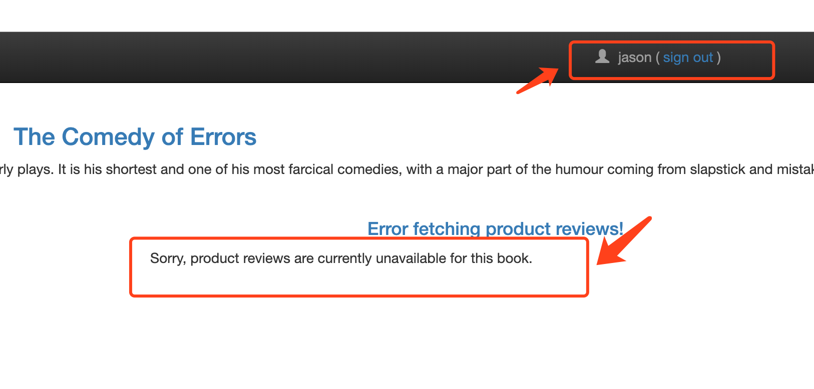

<!-- toc -->
# istio 的请求超时时间设置

这里的 [Request Timeouts][2] 是等待目标服务响应的超时时间，如果目标服务的响应时间超过了设置，代理本次请求的 envoy 不在等待，直接向请求端返回失败。超时时间在 [VirtualService](./vsvc.md) 中设置。

下面操作在 [Bookinfo Application](./bookinfo.md) 的基础上进行。

## 设置请求超时时间

编辑名为 reviews 的 VirtualService，在 route  中添加一个超时时间：

```yaml
$ kubectl edit vs reviews
... 省略 ...
- match:
  - headers:
      end-user:
        exact: jason
  route:
  - destination:
      host: reviews
      subset: v2
  timeout: 0.5s
... 省略 ...
```

上面设置的超时时间只对带有 "end-user: jason" 的请求有效。

为了验证超时效果，用 [错误注入](./injection.md) 功能为 reviews 服务依赖的 ratings 服务注入超过 2s 的超时：

```yaml
$ kubectl edit vs ratings
...省略...
  http:
  - fault:
      delay:
        percent: 100
        fixedDelay: 2s
    match:
    - headers:
        end-user:
          exact: jason
    route:
    - destination:
        host: ratings
        subset: v1
  - route:
    - destination:
        host: ratings
        subset: v1
...省略...
```

只对带有 "end-user: jason" 的请求注入超时。注入超时后，ratings 接口的响应时间超过 2 秒：

```sh
$ time curl  -H "end-user: jason"  http://ratings:9080/ratings/0
{"id":0,"ratings":{"Reviewer1":5,"Reviewer2":4}}
real	0m2.043s
user	0m0.008s
sys	0m0.019s
```

reviews 服务依赖 ratings 服务，接口响应时间会同时被拉长，继而触发前面设置的 0.5s 超时：

```sh
$ curl -H "end-user: jason"  http://reviews:9080/reviews/0
upstream request timeout
```



## 参考

1. [李佶澳的博客][1]

[1]: https://www.lijiaocn.com "李佶澳的博客"
[2]: https://istio.io/docs/tasks/traffic-management/request-timeouts/ "Request Timeouts"
