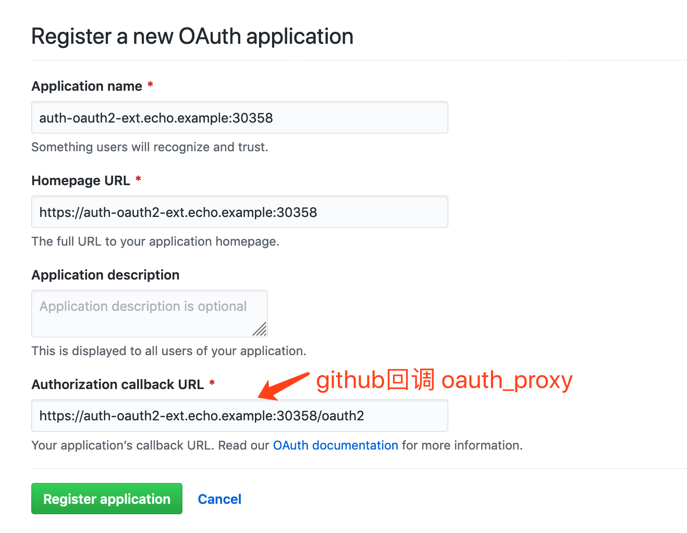
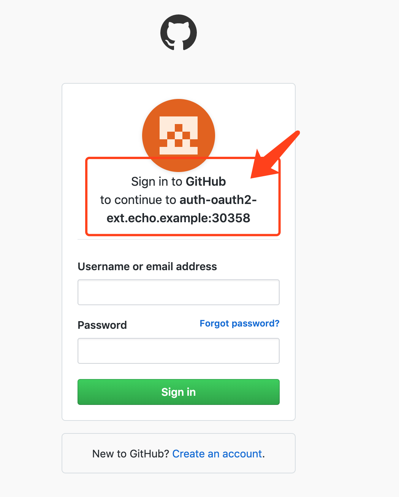
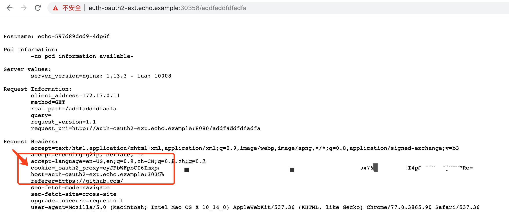

<!-- toc -->
# ingress-nginx 对接外部的认证服务 

ingress-nginx [自带认证功能](./auth.md)，也支持对接外部的认证服务。

## 对接外部的 Basic Auth

```sh
cd 04-auth-basic-ext/
```

###  准备外部 basic auth 服务

准备一个外部的 Basic Auth，[https://httpbin.org/ ][2] 是一个很好的选择。

httbin.org 有一个接口 `https://httpbin.org/basic-auth/{user}/{passwd}`，这是一个认证地址，用户名就是 url 中的 user，密码就是 passwd，如下：

```sh
$ curl -u user1:passwd1 https://httpbin.org/basic-auth/user1/passwd1
{
  "authenticated": true,
  "user": "user1"
}
```

### 创建使用外部认证的 ingress

auth-url 是外部认证地址：

```yaml
apiVersion: extensions/v1beta1
kind: Ingress
metadata:
  name: ingress-echo-with-auth-basic-ext
  annotations:
    nginx.ingress.kubernetes.io/auth-url: "https://httpbin.org/basic-auth/user1/passwd1"
spec:
  rules:
  - host: auth-basic-ext.echo.example
    http:
      paths:
      - path: /
        backend:
          serviceName: echo
          servicePort: 80
```

执行：

```sh
$ kubectl -n demo-echo create -f auth-basic-ext-ingress.yaml
```

```sh
$ kubectl -n demo-echo get ingress -o wide
NAME                               HOSTS                         ADDRESS   PORTS     AGE
ingress-echo                       echo.example                            80        45d
ingress-echo-with-auth-basic       auth-basic.echo.example                 80        2d20h
ingress-echo-with-auth-basic-ext   auth-basic-ext.echo.example             80        21s
ingress-echo-with-auth-cert        auth-cert.echo.example                  80, 443   2d1h
```

### 使用效果

不提供用户名和密码：

```sh
$ curl -H "Host: auth-basic-ext.echo.example" 192.168.99.100:30933
<html>
<head><title>401 Authorization Required</title></head>
<body>
<center><h1>401 Authorization Required</h1></center>
<hr><center>openresty/1.15.8.1</center>
</body>
</html>
```

提供错误的用户名或密码：

```sh
$ curl -u user:nopass -H "Host: auth-basic-ext.echo.example" 192.168.99.100:30933
<html>
<head><title>401 Authorization Required</title></head>
<body>
<center><h1>401 Authorization Required</h1></center>
<hr><center>openresty/1.15.8.1</center>
</body>
</html>
```

提供正确的用户名和密码：

```sh
$ curl -u user1:passwd1 -H "Host: auth-basic-ext.echo.example" 192.168.99.100:30933

Hostname: echo-597d89dcd9-4dp6f

Pod Information:
    -no pod information available-
```

## 对接外部的 OAuth2 服务

OAuth2 服务的地址同样在 annotation 中设置，为了避免额外的折腾，这里全部使用 https，否则需要调整 lijiaocn/oauth2_proxy:v4.0.0 的启动参数。

```sh
cd 05-2-auth-oauth-ext
```

### 准备外部 OAuth2 服务

Github 支持 OAuth2 认证，通过地址 [https://github.com/settings/applications/new ][3] 注册使用 github OAuth2 的应用：



创建之后获得 Client ID 和 Client Secret：


启动容器 github_oauth2_proxy，该容器用于代理到 github 的 OAuth2 认证，用 github 分配的 client id 和 client secret 启动：

```sh
$ ./github-oauth-proxy.sh
$ docker ps
CONTAINER ID        IMAGE                          COMMAND                  CREATED             STATUS              PORTS                    NAMES
b9fc2924b9eb        lijiaocn/oauth2_proxy:v4.0.0   "/bin/oauth2_proxy -…"   5 seconds ago       Up 4 seconds        0.0.0.0:4180->4180/tcp   github_oauth2_proxy
```

这里的 github_oauth2_proxy 服务地址为 192.168.99.1:4180，需要确保两件事：

* 能够用浏览器打开这个地址；
* ingress-nginx 容器能够访问该地址：


如果当前没有登录 github，点击 Sign in with Github 会弹出 github 登录页面。
现在还没有配置 auth-oauth2-ext.echo.example 的 ingress，登录后的回调页面打不开，且会报 url 不一致的 OAuth2 认证错误。

github_oauth2_proxy 位于 kubernetes 外部， 按照 [Kubernetes 导入外部服务](../svc/external.md) 的做法导入：

```sh
$ kubectl -n demo-echo apply -f external-github-oauth2-proxy.yaml
```

### 配置目标应用的 Ingress

为目标应用创建 tls 证书，保存在名为 oauth2-tls-secret 的 secret 中：

```sh
echo "生成自签署的 ca 证书"
openssl req -x509 -sha256 -newkey rsa:4096 -keyout ca.key -out ca.crt -days 3560 -nodes -subj '/CN=My Cert Authority'

echo "生成用上述 ca 签署的 server 证书"
openssl req -new -newkey rsa:4096 -keyout server.key -out server.csr -nodes -subj '/CN=auth-oauth2-ext.echo.example'
openssl x509 -req -sha256 -days 3650 -in server.csr -CA ca.crt -CAkey ca.key -set_serial 01 -out server.crt
```

执行：

```sh
$ ./01-create-cert.sh
$ kubectl -n demo-echo create secret generic oauth2-tls-secret --from-file=tls.crt=server.crt --from-file=tls.key=server.key
```

为目标应用创建 ingress：

* 需要创建两个 ingress，一个指向目标应用，一个指向 github_oauth2_proxy；
* 两个 ingress 使用同样的 host，注意， **必须是两个 ingress** ；
* **指向 github_oauth2_proxy 的ingress 的 path 、在 github 中注册的 callback 地址、指向目标应用的 ingress 中的 auth-signin ，三者要一致**。


下面是指向目标应用的 ingress，auth-url 是 oauth 认证地址，auth-signin 是未认证或认证失败时的重定向地址，重定向地址是指向 github_oauth2_proxy 的 ingress 的 path：

```yaml
apiVersion: extensions/v1beta1
kind: Ingress
metadata:
  name: ingress-echo-with-auth-oauth2-ext
  annotations:
    # 如果 ingress-nginx 容器能够访问 auth-oauth2-ext.echo.example，写域名也可以，见后面的原理说明
    nginx.ingress.kubernetes.io/auth-url: "http://192.168.99.1:4180/oauth2/auth"
    nginx.ingress.kubernetes.io/auth-signin: "https://auth-oauth2-ext.echo.example:30358/oauth2/start?rd=$escaped_request_uri"
spec:
  rules:
  - host: auth-oauth2-ext.echo.example
    http:
      paths:
      - path: /
        backend:
          serviceName: echo
          servicePort: 80
  tls:
  - hosts:
    - auth-oauth2-ext.echo.example
    secretName: secret/oauth2-tls-secret
```

下面是指向 github_oauth2_proxy 的 ingress ，需要和上面的 ingress 使用同一个域名，否则会因为 url 不匹配而认证失败，上面的 ingress 中的 auth-signin 指定的 path 在这里配置（ /oauth2 ）：

```yaml
apiVersion: extensions/v1beta1
kind: Ingress
metadata:
  name: ingress-echo-with-auth-oauth2-ext-proxy
spec:
  rules:
  - host: auth-oauth2-ext.echo.example
    http:
      paths:
      - path: /oauth2
        backend:
          serviceName: external-github-oauth-proxy
          servicePort: 4180
  tls:
  - hosts:
    - auth-oauth2-ext.echo.example
    secretName: secret/oauth2-tls-secret
```

创建：

```sh
$ kubectl -n demo-echo create -f auth-oauth2-ext-ingress.yaml
```

### 使用效果

访问 https://auth-oauth2-ext.echo.example:30358 时，弹出 github 登录界面（未登录的时候）：



登录 github 后，客户端会被设置一个名 `_oauth2_proxy` 的 cookie，后续访问不需要登录 github：



### 原理说明

访问目标应用时候，ingress-nginx 容器会向 auth-url 发起认证，该认证由 ingress-nginx 容器发起，所以 ingress-nginx 容器必须能够访问 auth-url。

如果认证没有通过，ingress-nginx 容器将客户端重定向到 auth-signin。auth-signin 是目标应用的 oauth2 登录页面，这里是用 github_oauth2_proxy 容器实现的。 auth-signin 地址是客户端要访问的，ingress-nginx 容器能否访问没有影响。 

客户端被重定向到 oauth2 登录页面后，点击登录，进入 github 的登录页面。

用户登录 github 后，github 再将客户端重定向到在 github 中配置的回调地址（即 github_oauth2_proxy 的 path），该回调地址由客户端访问，github 能否访问没有影响：


客户端访问回调地址后，github_oauth2_proxy 在客户端设置 cookie，并将客户端重定向到最初的访问地址。

带有 cookie 的客户端再次访问目标应用时，通过了 auth-url 的认证，访问到目标服务。

## 参考

1. [李佶澳的博客][1]
2. [External Basic Authentication][5]
3. [External OAUTH Authentication][4]

[1]: https://www.lijiaocn.com "李佶澳的博客"
[2]: https://httpbin.org/#/Auth/get_basic_auth__user___passwd_ "https://httpbin.org/"
[3]: https://github.com/settings/applications/new "https://github.com/settings/applications/new"
[4]: https://kubernetes.github.io/ingress-nginx/examples/auth/oauth-external-auth/ "oauth-external-auth"
[5]: https://kubernetes.github.io/ingress-nginx/examples/auth/external-auth/ "External Basic Authentication"
