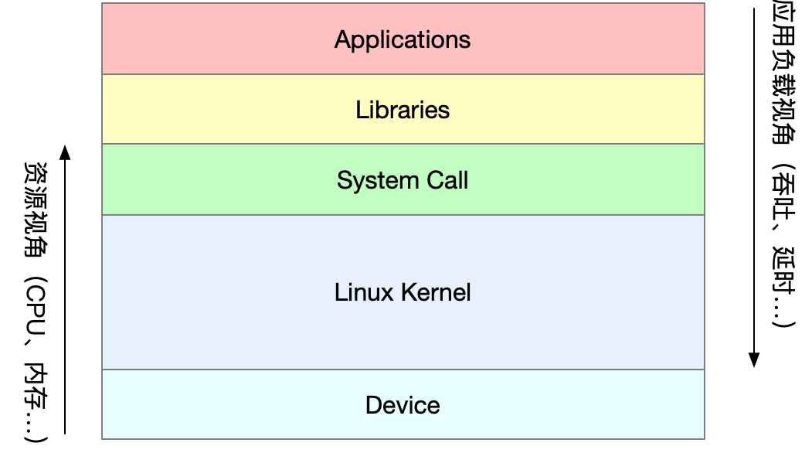
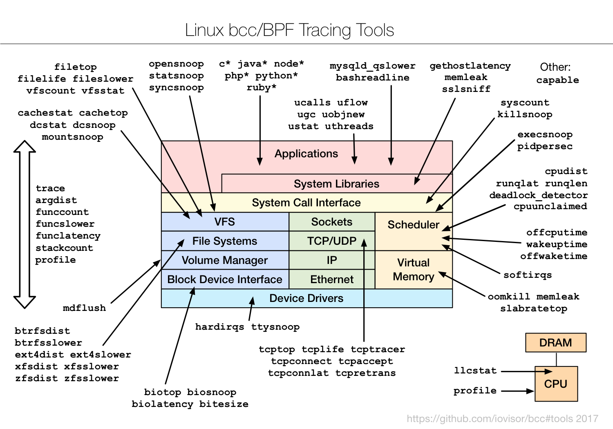
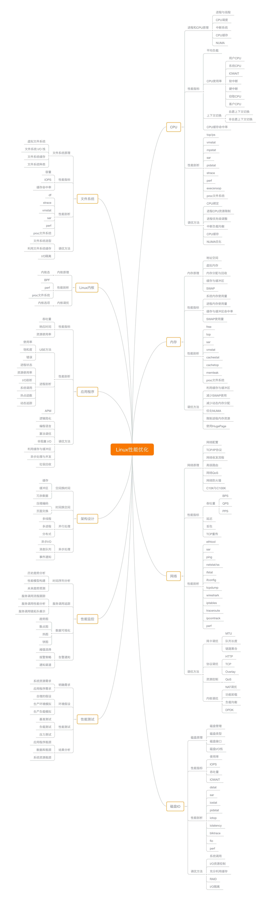

# 形成认识框架

认识框架（也就是知识大纲）非常重要，宏观上有了理解之后：1）才能有的放矢的深入细节，并能将繁杂多样的细节串联起来；2）在遇到问题的时候，才有能够正确的思考，有头绪、有方法、有步骤的调查问题、解决问题。

下面这张图是最宏观的图片，从上往下是“应用->库->系统调用->内核->设备”，如果发现一个应用的性能特别不理想，可以按照这个顺序查找问题所在，即先查应用、再查依赖库、然后查系统、最后查硬件。

(图片来源：倪鹏飞，极客时间， [《Linux性能优化]》][1] )

Brendan Gregg制作了一份Linux性能工具图谱，这些工具可以用来定位各个方面的问题：

近几年比较流行的eBPF也提供了大量工具，eBPF的介绍见[《Linux内核功能eBPF入门学习》](https://www.lijiaocn.com/%E6%8A%80%E5%B7%A7/2019/02/25/ebpf-introduction-1.html):

注意上面两张工具图使用的`分类方法`（图片中间部分），这个分类就是我们要在头脑中形成记忆的认知框架，有了这个认知框架之后，在遇到性能问题的时候才会有清晰、明确的排查思路，不再抓瞎。

倪鹏飞的[Linux性能优化][1]专栏中给出的这张思维导图也是一个不错的知识框架，总共有10部分：`性能监控`、`性能测试`、`应用程序`、`架构设计`、`Linux内核`、`文件系统`、`CPU`、`内存`、`网络`、`磁盘`。

## 参考

[1]: https://www.lijiaocn.com/img/01-geek-linux-ercode.jpeg "倪鹏飞，极客时间，Linux性能优化"
