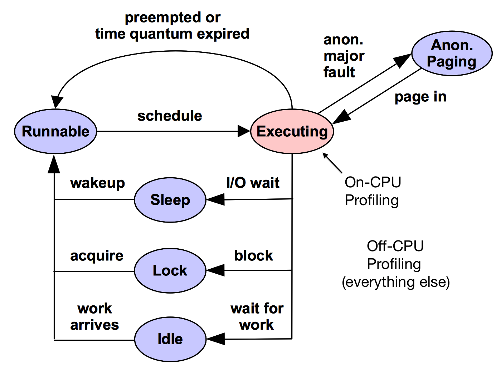

# 用火焰图分析CPU占用情况

CPU火焰图是最常用、最好理解的火焰图，它展现的是函数对CPU的占用情况，火焰图最上层是采样时正在使用CPU的函数：

CPU火焰图展现的是在CPU上发生的事情，下图中的红色部分（蓝色部分是CPU之外的事情，用后文中的Off-CPU火焰图展现）：

CPU火焰图最常用也最简单，[CPU Flame Graphs](http://www.brendangregg.com/FlameGraphs/cpuflamegraphs.html)介绍了几种制作方法，给出了C/C++/Jave/Node.js，以及其它语言编写的应用的CPU火焰图生成方法。

## 几种常用的采样工具

### perf

用perf采集指定CPU上发生的事件：

	perf record -F 99 -C 1,3 -g 

### DTrace

### SystemTap

### ktap

## 参考
