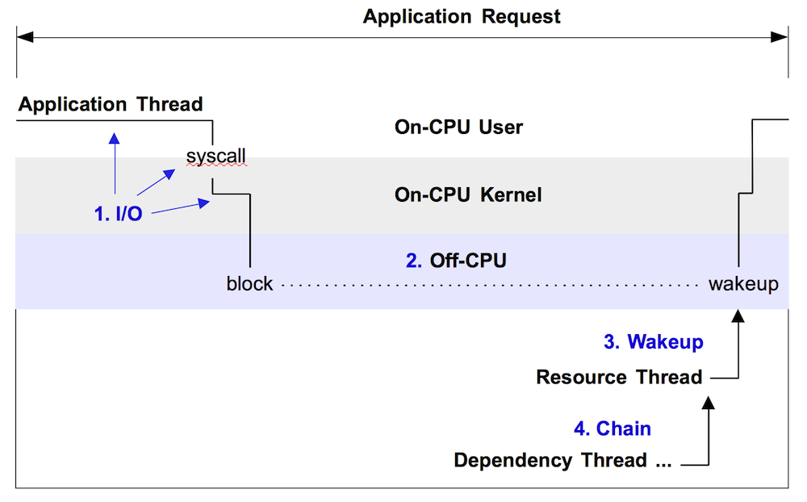
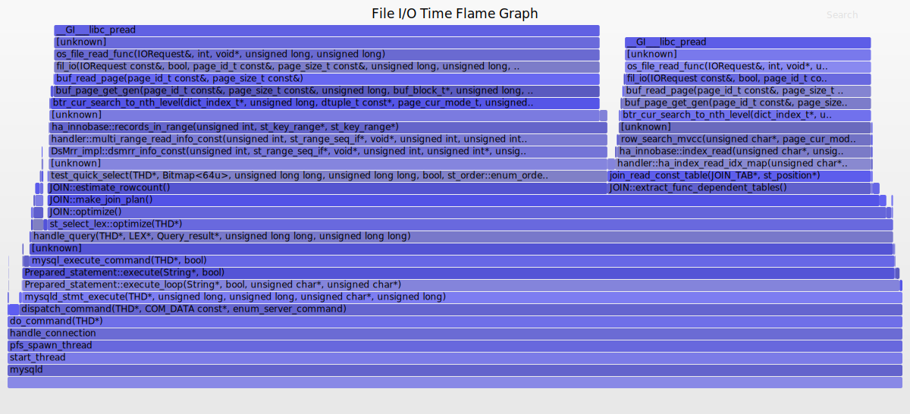
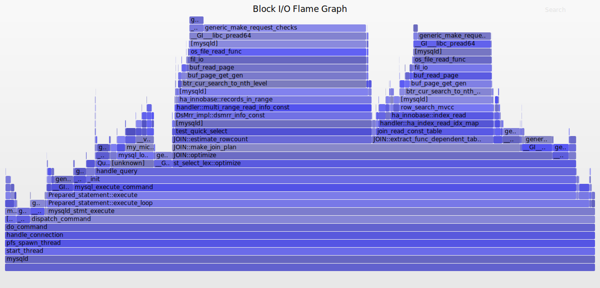
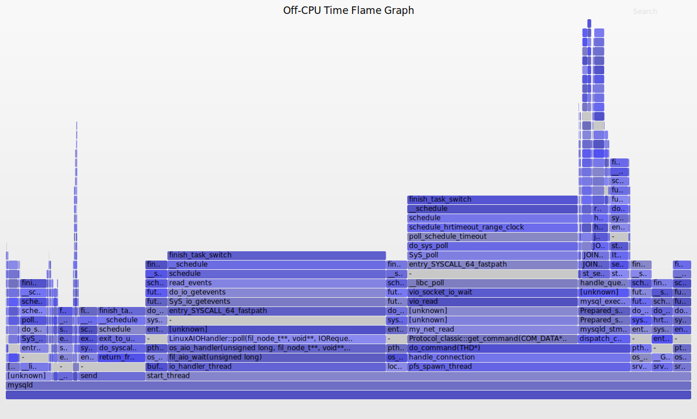
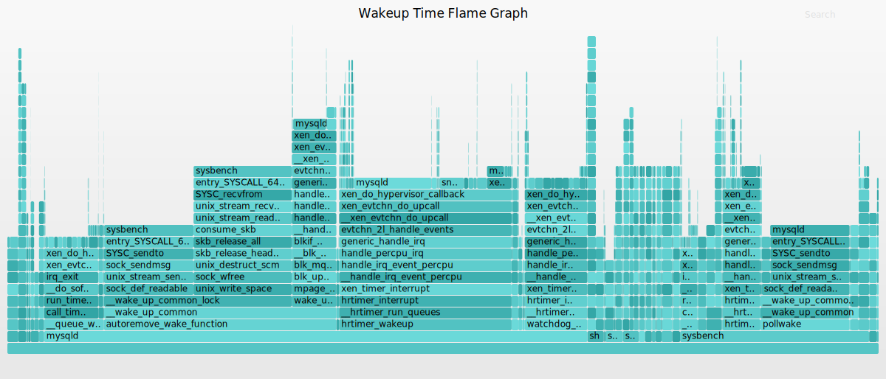

# 用火焰图分析未占用CPU期间的情况

应用程序的效率不高，也可能是被CPU之外的资源限制卡住了。

Brendan D. Gregg在[Off-CPU Analysis](http://www.brendangregg.com/offcpuanalysis.html)一文中阐述了这个想法：

	Performance issues can be categorized into one of two types:
	    On-CPU: where threads are spending time running on-CPU.
	    Off-CPU: where time is spent waiting while blocked on I/O, locks, timers, paging/swapping, etc.

通常我们更容易关注On-CPU上发生的事情，容易忽略Off-CPU期间发生的事情，Off-CPU仿佛水面下的冰山（下图中的蓝色部分） ：

章宜春最早践行了Off-CPU的想法，在[Introduction to off­CPU Time Flame Graphs](http://agentzh.org/misc/slides/off-cpu-flame-graphs.pdf)中生动简洁地介绍了自己的实践过程。

与内存管理函数有多个一样，Off-CPU期间是有多件事情的：

I/O期间有File I/O、Block Device I/O，通过采集进程让出CPU时调用栈，可以知道哪些函数正在频繁地等待其它事件，以至于需要让出CPU，通过采集进程被唤醒时的调用栈，可以知道哪些函数让进程等待的时间比较长。

## File I/O 火焰图

## Block I/O 火焰图

## Off-CPU 火焰图

## Wakeup 火焰图

## 参考
