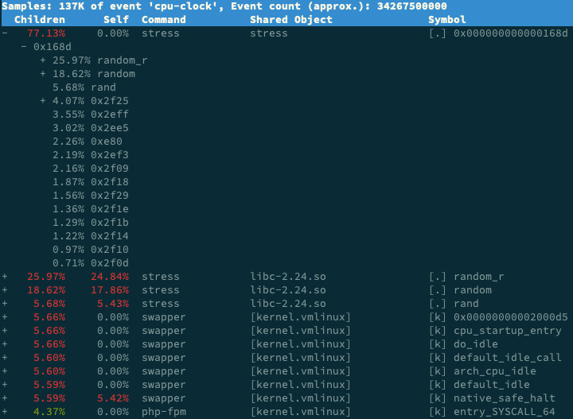

<!-- toc -->
# Linux中查看CPU的使用情况


CPU使用分析主要就是分析CPU的使用率，看看那些进程占用的CPU资源比较多。

## top/htop/atop查看CPU使用情况

top命令不多说了，需要注意的是在top中键入`H`后，进入线程模式。

htop和atop是两个功能更丰富的类top工具：

	yum install -y htop atop

## pidstat查看进程的CPU使用率

`pidstat`命令可以显示每个进程的在不同CPU状态中耗费的时间的百分比(1，每秒显示一次；-p，指定进程，如果不指定，显示所有进程)：

```bash
$ pidstat  1 -p  27936
Linux 3.10.0-693.11.6.el7.x86_64 (10.10.64.58) 	12/04/2018 	_x86_64_	(4 CPU)

05:00:59 PM   UID       PID    %usr %system  %guest    %CPU   CPU  Command
05:01:00 PM    99     27936    0.00    0.00    0.00    0.00     0  openresty
05:01:01 PM    99     27936    0.00    0.00    0.00    0.00     0  openresty
05:01:02 PM    99     27936    0.00    0.00    0.00    0.00     0  openresty
```

## perf top查看CPU占用高的函数

`perf top`显示占用CPU时间最多的函数或者指令：

```bash
$ perf top
Samples: 3K of event 'cpu-clock', Event count (approx.): 903937500
Overhead  Shared Object          Symbol
   8.69%  perf                   [.] symbols__insert
   5.33%  perf                   [.] rb_next
   3.41%  [kernel]               [k] _raw_spin_unlock_irqrestore
   3.12%  libc-2.17.so           [.] __memcpy_ssse3_back
   2.40%  [kernel]               [k] finish_task_switch
   2.40%  libc-2.17.so           [.] __strchr_sse42
   2.08%  libelf-0.168.so        [.] gelf_getsym
...省略后续内容...
```

## perf report查看cpu事件占比

用`perf record`将采样数据保存，然后用`perf record`查看，或者直接用下面的命令一次完成，`-a`查看所有cpu： 

```sh
perf record -ag  -- sleep 15;perf report
```

perf report中显示，stress进程的cpu事件占比是77%，它大量调用了随机数生成函数random()：



## vmstat查看上下文切换

`vmstat`命令显示系统整体状态，输出如下：

```bash
$ vmstat
procs -----------memory---------- ---swap-- -----io---- -system-- ------cpu-----
 r  b   swpd   free   buff  cache   si   so    bi    bo   in   cs us sy id wa st
 1  0   5980 126076    648 6997448    0    0     6    27   13    1  1  1 97  0  0
```

可以在后面加上一个数字，每隔指定时间输出一次，例如`vmstat 5`，如果感觉数据排列太密集，可以加上参数`-w`，用宽格式显示。

vmstat命令的输出包含`procs`、`memory`、 `swap`、`io`、`system`和`cpu`六块内容。

每列数据的含义如下，可以在`man vmstat`中找到：

	Procs
	    r: The number of runnable processes (running or waiting for run time).
	    b: The number of processes in uninterruptible sleep.
	
	Memory
	    swpd: the amount of virtual memory used.
	    free: the amount of idle memory.
	    buff: the amount of memory used as buffers.
	    cache: the amount of memory used as cache.
	    inact: the amount of inactive memory.  (-a option)
	    active: the amount of active memory.  (-a option)
	
	Swap
	    si: Amount of memory swapped in from disk (/s).
	    so: Amount of memory swapped to disk (/s).
	
	IO
	    bi: Blocks received from a block device (blocks/s).
	    bo: Blocks sent to a block device (blocks/s).
	
	System
	    in: The number of interrupts per second, including the clock.
	    cs: The number of context switches per second.
	
	CPU
	    These are percentages of total CPU time.
	    us: Time spent running non-kernel code.  (user time, including nice time)
	    sy: Time spent running kernel code.  (system time)
	    id: Time spent idle.  Prior to Linux 2.5.41, this includes IO-wait time.
	    wa: Time spent waiting for IO.  Prior to Linux 2.5.41, included in idle.
	    st: Time stolen from a virtual machine.  Prior to Linux 2.6.11, unknown.

其中`cs`是一秒内发生的上下文切换次数。

## pidstat查看特定进程的切换情况

`pidstat -w`可以显示每个进程的上下文切换情况：

```bash
$ pidstat -w
Linux 3.10.0-693.11.6.el7.x86_64 (10.10.64.58) 	12/04/2018 	_x86_64_	(4 CPU)

04:04:15 PM   UID       PID   cswch/s nvcswch/s  Command
04:04:15 PM     0         1      1.75      0.00  systemd
04:04:15 PM     0         2      0.01      0.00  kthreadd
04:04:15 PM     0         3      2.54      0.00  ksoftirqd/0
...省略后续内容...
```

（可以在后面上一个数字，每隔指定时间输出一次，例如`pidstat -w 5`）

特别注意：pidstats -w显示的是进程的状态，如果要将线程一并显示出来，需要再加一个-t参数：

```bash
$ pidstat -wt
Average:      UID      TGID       TID   cswch/s nvcswch/s  Command
Average:        0         3         -      3.92      0.00  ksoftirqd/0
Average:        0         -         3      3.92      0.00  |__ksoftirqd/0
Average:        0         9         -     45.59      0.00  rcu_sched
Average:        0         -         9     45.59      0.00  |__rcu_sched
Average:        0        13         -      1.96      0.00  ksoftirqd/1
Average:        0         -        13      1.96      0.00  |__ksoftirqd/1
Average:        0        17         -      0.49      0.00  migration/2
...省略后续内容...
```

`-w`参数的作用是显示进程切换状态，每一列的含义如下（可以在`man pidstat`中找到）：

	 -w     Report task switching activity (kernels 2.6.23 and later only).  
	        The following values may be displayed:
	  UID
	         The real user identification number of the task being monitored.
	
	  USER
	         The name of the real user owning the task being monitored.
	
	  PID
	         The identification number of the task being monitored.
	
	  cswch/s
	         Total number of voluntary context switches the task made per second.  
	         A voluntary context switch occurs when a task blocks because it requires 
	         a resource that is unavailable.
	
	  nvcswch/s
	         Total number of non voluntary context switches the task made per second.  
	         A involuntary context switch takes place when a task executes for the duration 
	         of its  time  slice  and then is forced to relinquish the processor.
	
	  Command
	         The command name of the task.

需要注意自愿切换（cswch/s，voluntary context switches）和非自愿切换（nvcswch/s，non voluntary context switches）的区别。前者是因为需要的资源没有准备好，主动让出CPU发生的切换，后者是进程分配的时间片已经用完，被调度器强制切换。

另外pidstat还有一个`-u`参数，可以一并输出进程和线程（加-t）的CPU使用情况：

```bash
[root@10.10.64.58 ~]#  pidstat -wt -u
Linux 3.10.0-693.11.6.el7.x86_64 (10.10.64.58) 	12/04/2018 	_x86_64_	(4 CPU)

04:21:56 PM   UID      TGID       TID    %usr %system  %guest    %CPU   CPU  Command
04:21:56 PM     0         1         -    0.02    0.01    0.00    0.03     0  systemd
04:21:56 PM     0         -         1    0.02    0.01    0.00    0.03     0  |__systemd
04:21:56 PM     0         2         -    0.00    0.00    0.00    0.00     0  kthreadd
04:21:56 PM     0         -         2    0.00    0.00    0.00    0.00     0  |__kthreadd
...省略后续内容...

04:21:56 PM   UID      TGID       TID   cswch/s nvcswch/s  Command
04:21:56 PM     0         1         -      1.75      0.00  systemd
04:21:56 PM     0         -         1      1.75      0.00  |__systemd
04:21:56 PM     0         2         -      0.01      0.00  kthreadd
04:21:56 PM     0         -         2      0.01      0.00  |__kthreadd
04:21:56 PM     0         3         -      2.53      0.00  ksoftirqd/0
...省略后续内容...
```

## /proc/interrupts记录的中断状态

`watch -d cat /proc/interrupts`用可以显示中断的变化情况。

```bash
Every 2.0s: cat /proc/interrupts                                                                                                                                                    Tue Dec  4 16:29:25 2018

           CPU0       CPU1	 CPU2       CPU3
  0:        153          0          0          0   IO-APIC-edge      timer
  1:         10          0          0          0   IO-APIC-edge      i8042
  6:          3          0          0          0   IO-APIC-edge      floppy
  8:          0          0          0          0   IO-APIC-edge      rtc0
  9:          0          0          0          0   IO-APIC-fasteoi   acpi
 10:          0          0          0          0   IO-APIC-fasteoi   virtio0
 11:         31          0          3          0   IO-APIC-fasteoi   uhci_hcd:usb1
 12:         15          0          0          0   IO-APIC-edge      i8042
 14:          0          0          0          0   IO-APIC-edge      ata_piix
 15:          0          0          0          0   IO-APIC-edge      ata_piix
 24:          0          0          0          0   PCI-MSI-edge      virtio3-config
 25:	   6234          0     120283     272843   PCI-MSI-edge      virtio3-req.0
 26:          0          0          0          0   PCI-MSI-edge      virtio1-config
 27:         99  176029503  172147021          0   PCI-MSI-edge      virtio1-input.0
 28:         24       2721        497       4165   PCI-MSI-edge      virtio1-output.0
 29:          0          0          0          0   PCI-MSI-edge      virtio2-config
 30:         19          0          0          0   PCI-MSI-edge      virtio2-virtqueues
 31:          0          0          0          0   PCI-MSI-edge      virtio4-config
 32:     131111          0          0          0   PCI-MSI-edge      virtio4-req.0
NMI:          0          0          0          0   Non-maskable interrupts
LOC:   64284244   70653905   70450086   65741168   Local timer interrupts
SPU:          0          0          0          0   Spurious interrupts
PMI:          0          0          0          0   Performance monitoring interrupts
IWI:    1242971    1424513    1360783    1296367   IRQ work interrupts
RTR:          0          0          0          0   APIC ICR read retries
RES:   33708963   29562936   30300354   32946303   Rescheduling interrupts
CAL:  131150935   64213698   67023823  133615842   Function call interrupts
TLB:     519133     541110     531432     522850   TLB shootdowns
TRM:          0          0          0          0   Thermal event interrupts
THR:          0          0          0          0   Threshold APIC interrupts
DFR:          0          0          0          0   Deferred Error APIC interrupts
MCE:          0          0          0          0   Machine check exceptions
MCP:	   2001       2001	 2001       2001   Machine check polls
ERR:          0
MIS:          0
PIN:          0          0          0          0   Posted-interrupt notification event
PIW:          0          0          0          0   Posted-interrupt wakeup event
```

`Rescheduling interrupts`是重调度中断，用来唤醒空闲的CPU执行新的任务。

## 参考
