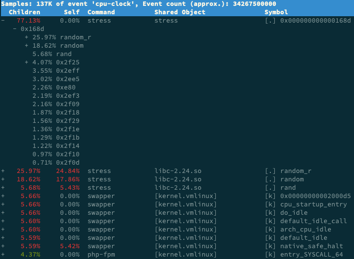

<!-- toc -->
# CPU使用率很高的排查方法

这是倪鹏飞的[《Linux性能优化实战》](https://www.lijiaocn.com/linux/img/linux/01-geek-linux-ercode.jpeg)中的案例，这里做了二次加工，抽取了主要过程，案例是倪鹏飞原文中的。

## 用top查看CPU使用情况

在top中看CPU的使用率很高，达到了80%以上，但是每个进程的CPU使用率都很低：

```sh
$ top
...
%Cpu(s): 80.8 us, 15.1 sy,  0.0 ni,  2.8 id,  0.0 wa,  0.0 hi,  1.3 si,  0.0 st
...

  PID USER      PR  NI    VIRT    RES    SHR S  %CPU %MEM     TIME+ COMMAND
 6882 root      20   0    8456   5052   3884 S   2.7  0.1   0:04.78 docker-containe
 6947 systemd+  20   0   33104   3716   2340 S   2.7  0.0   0:04.92 nginx
 7494 daemon    20   0  336696  15012   7332 S   2.0  0.2   0:03.55 php-fpm
 7495 daemon    20   0  336696  15160   7480 S   2.0  0.2   0:03.55 php-fpm
10547 daemon    20   0  336696  16200   8520 S   2.0  0.2   0:03.13 php-fpm
10155 daemon    20   0  336696  16200   8520 S   1.7  0.2   0:03.12 php-fpm
10552 daemon    20   0  336696  16200   8520 S   1.7  0.2   0:03.12 php-fpm
15006 root      20   0 1168608  66264  37536 S   1.0  0.8   9:39.51 dockerd
 4323 root      20   0       0      0      0 I   0.3  0.0   0:00.87 kworker/u4:1
...
```

## 用pidstat查看进程状态

每间隔1秒输出一组进程的状态，每个进程的CPU使用率都不高：

```sh
$ pidstat 1
...
04:36:24      UID       PID    %usr %system  %guest   %wait    %CPU   CPU  Command
04:36:25        0      6882    1.00    3.00    0.00    0.00    4.00     0  docker-containe
04:36:25      101      6947    1.00    2.00    0.00    1.00    3.00     1  nginx
04:36:25        1     14834    1.00    1.00    0.00    1.00    2.00     0  php-fpm
04:36:25        1     14835    1.00    1.00    0.00    1.00    2.00     0  php-fpm
04:36:25        1     14845    0.00    2.00    0.00    2.00    2.00     1  php-fpm
04:36:25        1     14855    0.00    1.00    0.00    1.00    1.00     1  php-fpm
04:36:25        1     14857    1.00    2.00    0.00    1.00    3.00     0  php-fpm
04:36:25        0     15006    0.00    1.00    0.00    0.00    1.00     0  dockerd
04:36:25        0     15801    0.00    1.00    0.00    0.00    1.00     1  pidstat
04:36:25        1     17084    1.00    0.00    0.00    2.00    1.00     0  stress
04:36:25        0     31116    0.00    1.00    0.00    0.00    1.00     0  atopacctd
...
```

## 观察top中的tasks

top中显示149个task，有6个在running状态，正在运行的进程数偏高（案例中的机器上，只运行了一个php开发的web应用，用ab对其发起了5个并发的压测）。

```sh
$ top
top - 04:58:24 up 14 days, 15:47,  1 user,  load average: 3.39, 3.82, 2.74
Tasks: 149 total,   6 running,  93 sleeping,   0 stopped,   0 zombie
%Cpu(s): 77.7 us, 19.3 sy,  0.0 ni,  2.0 id,  0.0 wa,  0.0 hi,  1.0 si,  0.0 st
KiB Mem :  8169348 total,  2543916 free,   457976 used,  5167456 buff/cache
KiB Swap:        0 total,        0 free,        0 used.  7363908 avail Mem

  PID USER      PR  NI    VIRT    RES    SHR S  %CPU %MEM     TIME+ COMMAND
 6947 systemd+  20   0   33104   3764   2340 S   4.0  0.0   0:32.69 nginx
 6882 root      20   0   12108   8360   3884 S   2.0  0.1   0:31.40 docker-containe
15465 daemon    20   0  336696  15256   7576 S   2.0  0.2   0:00.62 php-fpm
15466 daemon    20   0  336696  15196   7516 S   2.0  0.2   0:00.62 php-fpm
15489 daemon    20   0  336696  16200   8520 S   2.0  0.2   0:00.62 php-fpm
 6948 systemd+  20   0   33104   3764   2340 S   1.0  0.0   0:00.95 nginx
15006 root      20   0 1168608  65632  37536 S   1.0  0.8   9:51.09 dockerd
15476 daemon    20   0  336696  16200   8520 S   1.0  0.2   0:00.61 php-fpm
15477 daemon    20   0  336696  16200   8520 S   1.0  0.2   0:00.61 php-fpm
24340 daemon    20   0    8184   1616    536 R   1.0  0.0   0:00.01 stress
24342 daemon    20   0    8196   1580    492 R   1.0  0.0   0:00.01 stress
24344 daemon    20   0    8188   1056    492 R   1.0  0.0   0:00.01 stress
24347 daemon    20   0    8184   1356    540 R   1.0  0.0   0:00.01 stress
...
```

同时，top中显示正在运行的进程是stress。

## 用pidstat/ps查看running状态的进程

用pidstat查看running状态的stress进程，结果没有该进程的数据：

```sh
$ pidstat -p 24344

16:14:55      UID       PID    %usr %system  %guest   %wait    %CPU   CPU  Command
```

用ps查看，发现这个进程不存在：

```sh
$ ps aux | grep 24344
root      9628  0.0  0.0  14856  1096 pts/0    S+   16:15   0:00 grep --color=auto 24344
```

到了关键时刻，为什么正在running的进程不存在，这些消失的进程和cpu的使用率高有没有关系？

再次用top观察running状态的进程，发现stress进程的进程号一直变化。也就是说，stress进程不停的退出，
同时又不断的新建。

## 用pstree查看进程的父子关系

用pstree找到创建stress进程的父进程，stress进程是php-fpm通过sh创建的：

```sh
$ pstree | grep stress
        |-docker-containe-+-php-fpm-+-php-fpm---sh---stress
        |         |-3*[php-fpm---sh---stress---stress]
```

pstree安装方法：

```sh
yum install -y psmisc
```

## 检查php应用代码

检查php应用代码发现，代码中调用了stress命令，模拟I/O压力，但是用top看到的现象是cpu使用率高，这是比较奇怪的地方：。

```php
$ cat app/index.php
<?php
// fake I/O with stress (via write()/unlink()).
$result = exec("/usr/local/bin/stress -t 1 -d 1 2>&1", $output, $status);
if (isset($_GET["verbose"]) && $_GET["verbose"]==1 && $status != 0) {
  echo "Server internal error: ";
  print_r($output);
} else {
  echo "It works!";
}
?>
```

检查这部分代码的运行日志，发现stress命令没有成功，因为权限问题直接退出了：

```
$ curl http://192.168.0.10:10000?verbose=1
Server internal error: Array
(
    [0] => stress: info: [19607] dispatching hogs: 0 cpu, 0 io, 0 vm, 1 hdd
    [1] => stress: FAIL: [19608] (563) mkstemp failed: Permission denied
    [2] => stress: FAIL: [19607] (394) <-- worker 19608 returned error 1
    [3] => stress: WARN: [19607] (396) now reaping child worker processes
    [4] => stress: FAIL: [19607] (400) kill error: No such process
    [5] => stress: FAIL: [19607] (451) failed run completed in 0s
)
```

初步怀疑，用php调用的stress没有权限创建临时文件，导致大量的stress进程不停地创建退出，从而是CPU使用率增高，因为这些进程很快退出，在top中能看到的stress进程的CPU使用率都很低。

## 用perf查看15秒内的CPU性能报告

`-a`查看所有cpu：

```sh
perf record -ag  -- sleep 15;perf report
```

perf report中显示，stress进程的cpu事件占比是77%，它大量调用了随机数生成函数random()，确定是它导致CPU使用率高：



## 小结与execsnoop

倪鹏飞设计的这个案例特别典型，问题根源特别隐蔽，导致CPU使用率高的stress进程很快退出，如果只观察进程的cpu使用率，是找不到问题根源的，需要从task中发现异常， 在用pstree厘清进程关系，从stress的父进程入手，最后用perf report坐实。

排查过程和排查思路才是重点。

另外，有一个名为`execsnoop`的工具，专门用来监控短时进程，用execsnoop监控的时候，会发现大量的stress进程不停的启动：

```sh
# 按 Ctrl+C 结束
$ execsnoop
PCOMM            PID    PPID   RET ARGS
sh               30394  30393    0
stress           30396  30394    0 /usr/local/bin/stress -t 1 -d 1
sh               30398  30393    0
stress           30399  30398    0 /usr/local/bin/stress -t 1 -d 1
sh               30402  30400    0
stress           30403  30402    0 /usr/local/bin/stress -t 1 -d 1
sh               30405  30393    0
stress           30407  30405    0 /usr/local/bin/stress -t 1 -d 1
...
```

## execsnoop安装方法

安装bcc，execsnoop是bcc中的一个工具：

```sh
yum install -y bcc
```

需要注意的是，execsnoop不在`*/bin`目录中（取决于CentOS版本）：

```sh
$ ls /usr/share/bcc/tools/execsnoop
/usr/share/bcc/tools/execsnoop
```

如果遇到下面的错误，说明内核版本太低，不支持ebpf，需要升级到4.1以上，并安装kernel-devel：

```sh
[root@prod-k8s-node-138-127 phops]# /usr/share/bcc/tools/execsnoop
In file included from <built-in>:2:
/virtual/include/bcc/bpf.h:13:10: fatal error: 'linux/bpf_common.h' file not found
#include <linux/bpf_common.h>
         ^~~~~~~~~~~~~~~~~~~~
1 error generated.
Traceback (most recent call last):
  File "/usr/share/bcc/tools/execsnoop", line 166, in <module>
    b = BPF(text=bpf_text)
  File "/usr/lib/python2.7/site-packages/bcc/__init__.py", line 318, in __init__
    raise Exception("Failed to compile BPF text")
Exception: Failed to compile BPF text
```

## 参考
