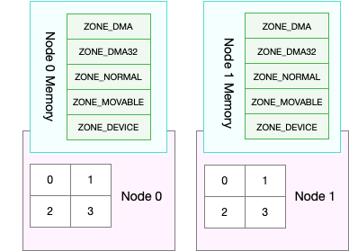

<!-- toc -->
# Linux的内存管理方法

## 虚拟内存地址空间划分


## 虚拟内存与物理内存的映射


## NUMA：node独立内存

在NUMA架构(多CPU)下，每个node（物理CPU）都有自己的本地内存，在分析内存的时候需要分析每个node的情况：



```sh
$ numactl --hardware
available: 1 nodes (0)
node 0 cpus: 0 1
node 0 size: 7977 MB
node 0 free: 4416 MB
...
```

/proc/sys/vm/zone_reclaim_mode设置NUMA本地内存的回收策略，当node本地内存不足时，默认可以从其它node寻找空闲内存，也可以从本地回收。

## Swap

Swap的设置开启：

```sh
# 创建 Swap 文件
$ fallocate -l 8G /mnt/swapfile
# 修改权限只有根用户可以访问
$ chmod 600 /mnt/swapfile
# 配置 Swap 文件
$ mkswap /mnt/swapfile
# 开启 Swap
$ swapon /mnt/swapfile
```

sar显示Swap的使用情看，-r 表示显示内存使用情况，-S 表示显示 Swap 使用情况：

```sh
$ sar -r -S 1
04:39:56    kbmemfree   kbavail kbmemused  %memused kbbuffers  kbcached  kbcommit   %commit  kbactive   kbinact   kbdirty
04:39:57      6249676   6839824   1919632     23.50    740512     67316   1691736     10.22    815156    841868         4

04:39:56    kbswpfree kbswpused  %swpused  kbswpcad   %swpcad
04:39:57      8388604         0      0.00         0      0.00

04:39:57    kbmemfree   kbavail kbmemused  %memused kbbuffers  kbcached  kbcommit   %commit  kbactive   kbinact   kbdirty
04:39:58      6184472   6807064   1984836     24.30    772768     67380   1691736     10.22    847932    874224        20

04:39:57    kbswpfree kbswpused  %swpused  kbswpcad   %swpcad
04:39:58      8388604         0      0.00         0      0.00
```

## 内存分配：brk()与mmap()

brk()分配的是堆中的内存，这些内存释放以后不会被立刻归还系统，而是被缓存起来重复使用。brk()会缓存获得的物理内存页，减少缺页异常，但是频繁的内存分配和释放会造成内存碎片。

mmap()分配的文件映射段的内存，释放时直接归还系统，下载再使用要再次触发缺页异常，让内核分配对应的物理内存。 mmap()直接归还获得的物理内存页，每次都会触发缺页异常，频繁内存分配会增加内核压力。

在C标准库中，小于128K的内存用brk()分配，大于128K的内存用mmap()分配。 

## 内核内存：伙伴系统

内核用伙伴系统管理内存分配。

## 内存泄露

BCC中的memleak用来检测内存泄露：

```sh
$ /usr/share/bcc/tools/memleak -p $(pidof app) -a
Attaching to pid 12512, Ctrl+C to quit.
[03:00:41] Top 10 stacks with outstanding allocations:
    addr = 7f8f70863220 size = 8192
    addr = 7f8f70861210 size = 8192
    addr = 7f8f7085b1e0 size = 8192
    addr = 7f8f7085f200 size = 8192
    addr = 7f8f7085d1f0 size = 8192
    40960 bytes in 5 allocations from stack
        fibonacci+0x1f [app]
        child+0x4f [app]
        start_thread+0xdb [libpthread-2.27.so] 
```

## 参考
