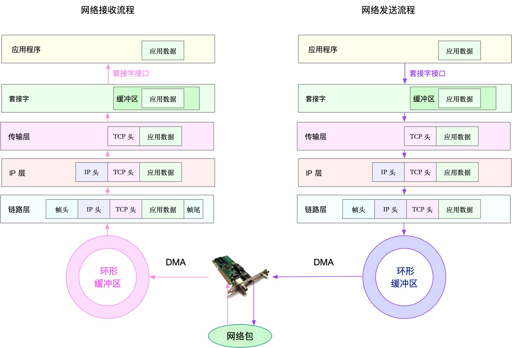
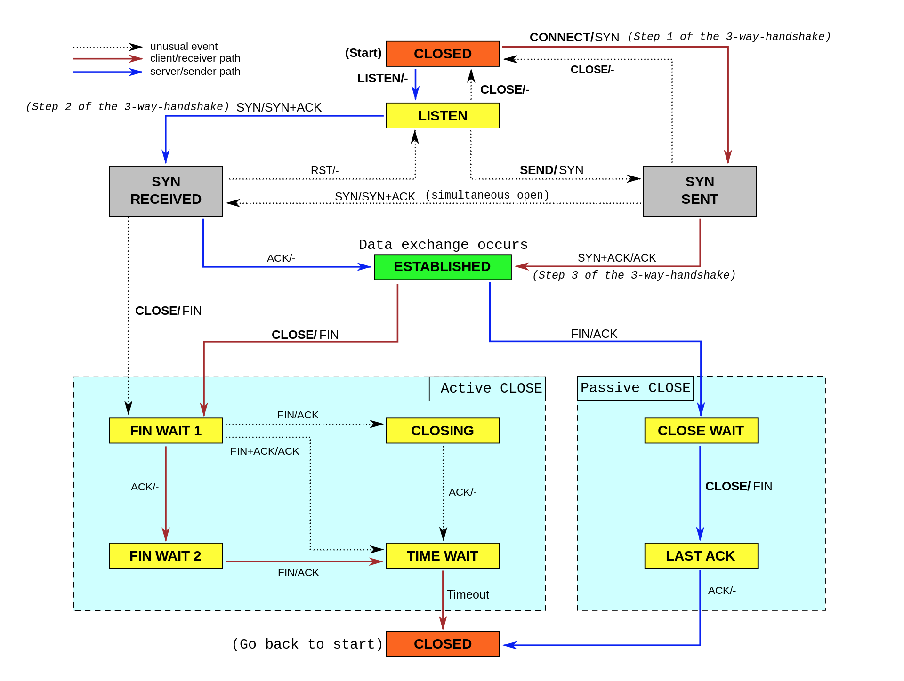

<!-- toc -->
# 理解Linux的网络

Linux网络相关知识。

## 指标和工具映射表

## 报文处理流程

## TCP连接状态

[TCP连接相关知识](https://www.lijiaocn.com/%E6%8A%80%E5%B7%A7/2017/09/04/linux-net-tcp.html)

## TCP参数调优

## 其它文章

[Finding out if/why a server is dropping packets](https://jvns.ca/blog/2017/09/05/finding-out-where-packets-are-being-dropped/)

[SNAT端口冲突，导致容器访问外部服务偶尔超时](https://mp.weixin.qq.com/s/VYBs8iqf0HsNg9WAxktzYQ)：

>需要在masquerade规则中设置flag NF_NAT_RANGE_PROTO_RANDOM_FULLY。iptables工具不支持设定这个flag，但是我们已经提交了一个小补丁增加这个特性，补丁已经合入（译者注：在iptables 1.6.2版本发布）。

>我们现在使用一个修改后的打了这个补丁的flannel版本，在masquerade规则中增加了flag --ramdom-fully。我们使用一个简单的Daemonset从每一个节点上获取conntrack的统计结并发送到InfluxDB来监控conntrack表的插入错误。我们已经使用这补丁将近一个月了，整个集群中的错误的数目从每几秒一次下降到每几个小时一次。

## 参考
