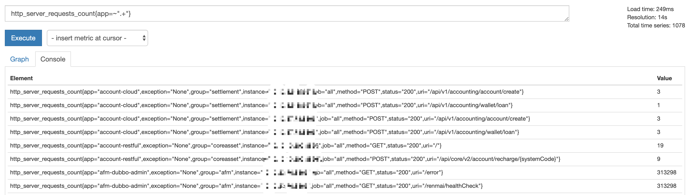
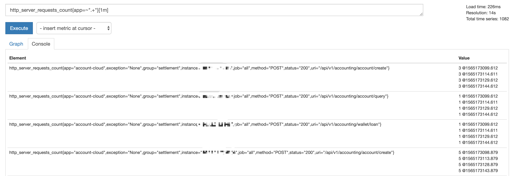

<!-- toc -->
# Prometheus 的查询语法

Prometheus 的数据查询语句叫做 Prometheus Query Language，提供了不少查询函数，表达能力比较丰富。
语句的执行结果有四种类型：

* Scalar: 浮点数值
* String: 字符串（预留类型，当前没有实现 2019-08-07 18:04:55）
* Instant vector：瞬时值数组，从不同采集地址采集到的同一指标的当前值组成的数组
* Range vector: 区间数组，从不同采集地址采集到的同一指标在一段时间的内数值组成的数组

前两种类型容易理解，Instant vector 和 Range vector 的有区别前者是一个一个当前值组成的数组，后者是一段区间里的数值组成的数组，继续组成的数组，一看便知：

**Instant vector**：



**Range vector**




## 指标查询

Prometheus 的指标查询语句基本格式为：

	指标名称{ 标签名=<数值> }

以 http_server_requests_count 为例，指标上带有 label，通过 label 区分不同来源的数据。

查询 method 为 POST，status 为 200 的采集数据：

```sh
http_server_requests_count{method="POST",status="200"}
```

标签条件支持 `=`、`!=`、`=~`（正则匹配）。

默认查询的是当前时间的数据，如果要查询过去的数据，使用 offset，例如查询 5 分钟前的数据：

```sh
http_server_requests_count{method="POST",status="200"} offset 5m
```

要查询指标在某一区间的数值，使用 []，[] 中是从当前时间相对于相对于 offet向前推的时间段，例如查询 5 分钟前的 1 分钟区间里的数据：

```sh
http_server_requests_count{method="POST",status="200"}[1m] offset 5m
```

## 参考

1. [李佶澳的博客][1]

[1]: https://www.lijiaocn.com "李佶澳的博客"
